<pre class="script">
template('OutSystems/OSVersionIndicator');</pre>

# The Detach Process

This document is a step-by-step guide for extracting the source code of your applications (web and mobile) from the .NET version of OutSystems and how to set it up to be executed and maintained independently of OutSystems, if you ever decide to detach from it. This is a complement to the [OutSystems Platform – Standard Architecture with No Lock-in](https://www.outsystems.com/goto/standard-architecture-with-no-lock-in) content that gives a high-level view on how OutSystems, unlike other proprietary technologies and frameworks, generates standard, optimized, and fully documented .NET source code that doesn't require runtime interpreters or engines.

## Detach process overview

The detach process applies when you wish to completely remove OutSystems. It's not possible to detach only some applications from OutSystems while keep other applications still using the OutSystems platform infrastructure. To perform a complete detach, you need to:

1. Guarantee that, before you start, you have all the requirements and followed all the recommendations in [Before you start](#before-you-start).
1. Prepare the Application Server and Database Server according to [Preparing your systems to run detached](#prepare).
1. Detach, compile, and deploy all individual modules and mobile apps as detailed in [Detaching an application from OutSystems](#detach-app).
1. Test the result application(s) without OutSystems as presented in [Final steps](#final-steps).

Make sure you read the full content of this document before you start to get a better overview of all the steps required and to better plan the process.

If at any step you run into a problem, you may need to repeat the previous steps until you get things working properly. Be careful and do not skip any instructions in the document to minimize the chance of making mistakes. In the case of not being able to proceed at any of those steps, you are free to contact OutSystems Support and we will happily help you.

## Before you start { #before-you-start }

The steps described in this document are not for evaluation purposes and are to be used only if you decide to stop using OutSystems.

### What do you need?

You need to fulfill the [system requirements](https://success.outsystems.com/Documentation/11/Setting_Up_OutSystems/OutSystems_system_requirements) and additionally must have Microsoft Build Tools 2019 installed.

### What will you lose?

If you choose to stop using OutSystems, you will no longer have access to all the application development, management, and operation capabilities of the platform. Also, you'll no longer benefit from the Embedded Change Technology (ECT), performance monitoring, and logging capabilities, which means you'll have to implement such functionality by resorting to other tools. You will however retain all core functionality of the applications you developed using Service Studio and Integration Studio, although any changes made to the detached source aren't supported by OutSystems anymore.

After detaching the source code of your applications, all OutSystems tools and services will become unavailable (including Service Studio, Integration Studio, Service Center, and LifeTime), along with all of their features for visual development and composition, services repository, integration adapters automatic generation, database, and application hot deployment, configuration management and versioning, packaging, and staging, automatic code containment and optimization, factory access control management, performance monitoring, and analytics.

Also notice that this is a one-way street. Once you detach the source code and start developing your applications using Visual Studio or Eclipse, there is no reverse engineering process to get those applications back into OutSystems.

### Recommendations before you start the detach process

To minimize the risks of getting errors during and after the detach process:

* Ensure that OutSystems applications are running with the expected behavior. Since OutSystems capabilities are lost, it will be more difficult to fix the majority of the problems after the detach.

* Update to the latest release of your OutSystems version to benefit from having all known bugs for that specific version fixed; This translates to having the latest Release of your **M**ajor.**m**inor.**R**elease.**r**evision version installed correctly.

* Detaching Development source code and deploying it to a Production Environment is not a valid process, as the generated code is different for each environment: the generated code considers the environment where it was compiled and the corresponding database. If you want to do this, first you need to stage your applications from one environment to another and only then you can proceed with the detach.

#### Personnel requirements

Since you will lose most of the OutSystems capabilities, you must guarantee that your personnel:

* Fully understands the complete life cycle of .NET applications. This includes understanding how to create, modify, and deploy those application, as well as creating and managing the references between them while having a good understanding of IIS.

* Has access to the Database Server and have the ability to modify the existing data. During the detach process, it's necessary to perform some changes in the OutSystems metadata. This is typically done by a DataBase Administrator (DBA).

* Knows how to develop, build, and deploy Android and/or iOS apps (applies to mobile apps only).

### OutSystems Scheduler Service

If you are using Timers or BPT Activities in your applications, you will be able to keep this functionality even after detaching. Unlike other OutSystems services, the source code of the Scheduler Service will be provided for this purpose, just contact OutSystems by opening a Support Case and requesting it.

To compile the scheduler, do the following:

1. Open the `Scheduler.sln` file (located in the Scheduler directory) using Visual Studio and build the solution.

1. Open the Developer Command Prompt for Visual Studio (with Administrator privileges) and go to the `\Scheduler\bin\Debug` folder.

1. Execute the following command:

    `installutil scheduler.exe`

    This installs a service called Detached Scheduler Service. To uninstall it, run `installutil /u scheduler.exe`. If any problem happens, check the scheduler logs in the Event Viewer.

If you choose to re-implement these services using external tools you can later remove this dependency manually.

### Understand how OutSystems structures the code

When you deploy an application module using 1-Click Publish operation, the OutSystems Compiler generates a standard .NET application. This is what's provided when you detach an application and download the source code.

The code is structured in the following folders:

* **OutSystems\.Application\.Core** – interfaces to access runtime information.
* **OutSystems\.Application\.Session** – shared code for the session runtime service.
* **OutSystems\.Application\.Session\.Interfaces** – session runtime service interface.
* **OutSystems\.Application\.Session\.Persistent** – session runtime service code that implements database persisted sessions.
* **DatabaseAbstractionLayer** – the interfaces and base code responsible for allowing the Platform access and manage the data from the database.
* **DatabaseProviders** –
    * **iDB2DatabaseProvider** – the iDB2 implementation of the DatabaseAbstractionLayer used by the platform when connected to an iDB2 database.
    * **MySQLDatabaseProvider** – the MySQL implementation of the DatabaseAbstractionLayer used by the platform when connected to a MySQL database.
    * **OracleDatabaseProvider** – the Oracle implementation of the DatabaseAbstractionLayer used by the platform when connected to an Oracle database.
    * **SQLServerDatabaseProvider** – the SQLServer implementation of the DatabaseAbstractionLayer used when connected to a SQLServer database.
* **OutSystems\.DebuggerClient** – the debbuger protocol code.
* **OutSystems\.Logging** – the logging system code.
* **OutSystems\.Logging\.Database** – interfaces for logging libraries that log to the database.
* **OutSystems\.ModuleServices** – shared code for BPT Activities.
* **OutSystems\.Plugin\.RabbitMQ** – a RabbitMQ based implementation of the cache invalidation service.
* **OutSystems\.PluginAPI** – code and interfaces to manage plugin configurations.
* **OutSystems\.Spreadsheet** – runtime code to load and export Excel files.
* **OutSystems\.RuntimeCommon** – the basic runtime code used by all runtime libraries and modules.
* **Plugin\.SAP** –
    * **Runtime** – runtime code responsible for consuming SAP services.
    * **RuntimeAPI** – API exposed to extend the SAP functionalities.
    * **SapNcoConnectionManager** – wrapper for the SAP .NET Connector libraries.
* **Plugin\.Widgets\.Runtime** – the runtime code for the various custom web controls using the WidgetsRuntimeAPI.
* **&lt;Project Name&gt;** – the module's source code.
* **REST\.RuntimeAPI** – used to consume REST services and to extend REST behaviors using extensibility.
* **RESTService.Runtime** – the runtime code used to expose REST services.
* **RuntimePlatform** – the Platform's runtime code used by the module.
* **Scheduler\.Core** – the scheduler core code.
* **ThirdParty** – third-party components that are necessary for the applications to work.
    * **EXIFExtractor** – the EXIFextractor is a .NET component which allows the extraction and manipulation of image files information.
    * **GemboxSpreadSheet** – the GemboxSpreadSheet .NET component which enables developers to write, read or convert spreadsheet files (XLS, CSV, XLSX, HTML, or ODS) from their .NET applications.
    * **Json\.NET** – the Newtonsoft Json\.NET is a library to serialize and deserialize between \.NET objects and JSON formats.
    * **SAP** – the SAP\.NET Connector libraries used by the SapNcoConnectionManager project.
    * **WebApi2** – the ASP\.NET Web API is a framework that makes it easy to build restful HTTP services.
* **WebWidgets** – the runtime code for the various custom web controls.
* **WidgetsRuntimeAPI** – framework to allow building custom web controls.

The following image shows the code structure of a sample generated application:

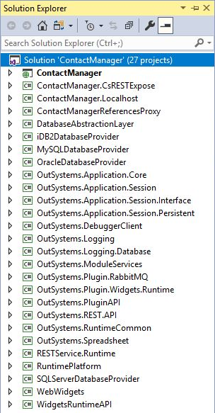  

In the application folder (`<Project Name>`) there is a set of packages that hold the different types of code. These folders are

* **Actions** – the code generated for both built-in actions and functions, and user actions and functions.
* **Blocks** – the code generated for both built-in and custom web blocks.
* **Entities** – the code to manage entities.
* **Structures** – the code to manage structures.
* **ProcExc&lt;ProcessName&gt;** – the code generated for processes.
* **Exceptions** – the declaration of user defined exceptions.
* **Roles** – the code to support role based security enforcement.
* **TypeFactory** – the code used by consumers of the module so they can access the referred elements.
* **WebServices** – the code to support all Web Services exposed by your module.
* **WebReferences** – the code to support all Web Services consumed by your module.

## Preparing your systems to run detached { #prepare }

### Preparing the Application Server to deploy the generated code { #prepare-app-server }

The machine that will run the detached applications must be prepared to that purpose. Making sure that all the requirements are met minimizes the chance of failure of this process.

Some web services of OutSystems communicate inside the machine through the HTTP protocol. This requires the machine to access itself using HTTP protocol, on port 80, in its local IP address, `127.0.0.1`, most commonly known as `localhost`.

You must guarantee that this is correctly configured, even if you only want to use HTTPS to access your applications.

To check it do the following:

1. Search for **IIS** in Windows Start Menu and open **Internet Information Services (IIS) Manager**.

1. In the left pane tree expand the following items:

    **&lt;your machine name&gt;** > **Sites** > **Default Web Site**

      

1. Make sure that there is a binding for the HTTP protocol on port 80 for IP address 127.0.0.1 at least. It's recommended that you use an asterisk (`*`) instead, as that means all IP address can access it. Leaving only the 127.0.0.1 address means that it can only be accessed locally.

    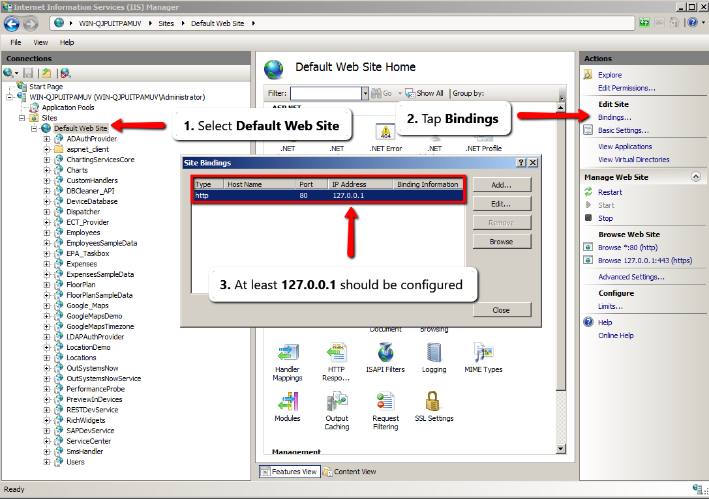

If you are using the same Application Server that previously hosted OutSystems, check [Using the Application Server that previously hosted OutSystems](#use-existing-app-server). Otherwise, if you're going to use a brand new Application Server, configure it according to [Using a brand new Application Server](#use-new-app-server).

#### Using the Application Server that previously hosted OutSystems { #use-existing-app-server }

In case of having SEO Friendly URLs, you will need to remove the ISAPI Filter, since SEO Rules will no longer work after detaching. To accomplish that:

1. Inside IIS (check [Preparing the Application Server to deploy the generated code](#prepare-app-server)), click on your **Default Web Site**.

1. In the middle-pane, find **ISAPI Filters** and double-click it.

    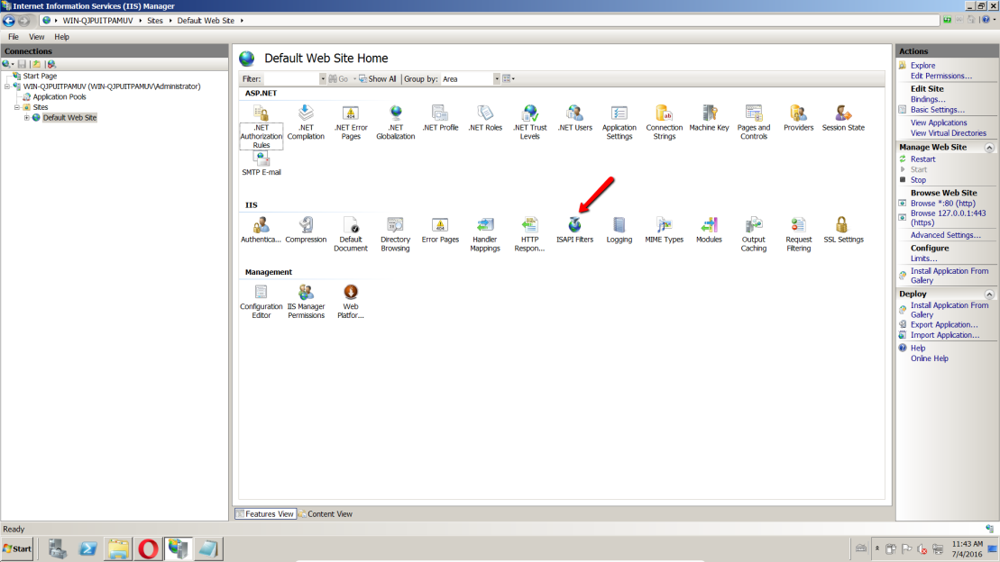  

1. Search for **OutSystems ISAPI Filter** and delete it.

    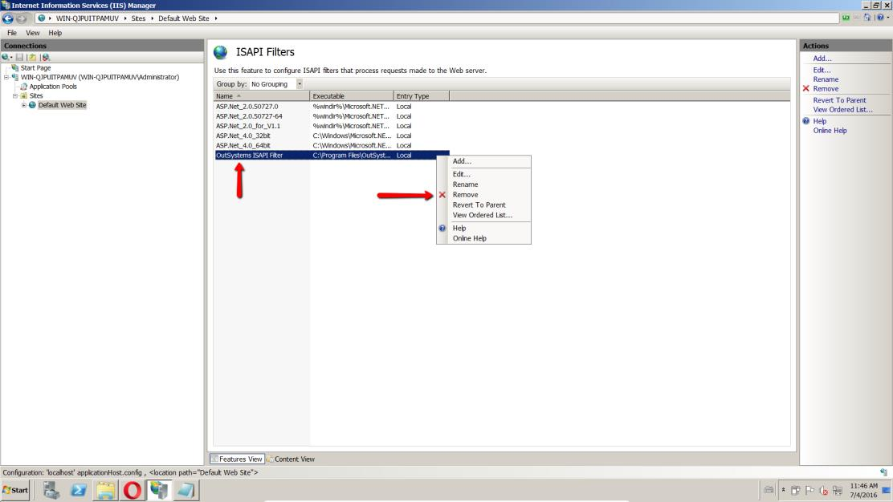

#### Using a brand new Application Server { #use-new-app-server }

If you want, you can deploy your module in a new server where you never installed OutSystems. If you're not considering this option, skip this section.

For the new Application Server to accommodate your applications, you must first set up the server with the needed configurations, as if you were installing OutSystems, skipping the OutSystems installation itself.

To do this, you will need to either decommission the OutSystems server, or get a database copy to use with the new server.

Do the following:

1. Install IIS component (as described in the [installation checklist](http://www.outsystems.com/goto/checklist-11)). If you want to use Visual Studio remotely (from a workstation), you must also install Frontpage Extensions.

1. Install .NET Framework 4.7.2 or above and configure it for use with IIS. Use the instructions in the install checklist.

1. Start Windows Management Instrumentation service.

1. Configure the Application Pool associated with Default Web Site in IIS to use .NET Framework 4.0 and Managed pipeline mode set to **Integrated**.

1. Update the data model in the OutSystems server:

    1. Update `OSSYS_SERVER` entity. Replace **new\_hostname** with the output of the **hostname** command ran in a command line (in the new server).

            update ossys_server
            set name = 'new_hostname'
            where name = 'old_hostname'

    1. Update `OSSYS_PARAMETER` entity. Replace **new\_hostname** with the output of the **hostname** command in a command line (in the new server), and **old\_hostname** with the output in the old server.

            update ossys_parameter
            set host = 'new_hostname'
            where host = 'old_hostname'  

    1. Update `OSSYS_MODULEFRONTEND` entity. Replace **new\_hostname** with the output of the hostname command in a command line (in the new server), and **old\_hostname** with the output in the old server.

            update ossys_modulefrontend
            set frontendname = 'new_hostname'
            where frontendname = 'old_hostname'

    1. Update `OSSYS_MODULEINTERNALADDRESS` entity to reflect your factory deployment zones configurations, which maps each module to the respective deployment zone internal address. Replace **old\_address** with the old deployment zone address and **new\_address** with the new address where the module is deployed.

            update ossys_moduleinternaladdress
            set deploymentzoneaddress = 'new_address'
            where deploymentzoneaddress = 'old_address'

        If you'll be running modules in different front-end servers, you can identify each module with the `MODULEKEY` column and update its `DEPLOYMENTZONEADDRESS` accordingly:

            select ossys_moduleinternaladdress.modulekey, ossys_espace.name
            from ossys_moduleinternaladdress
            inner join ossys_espace
                on ossys_espace.ss_key = ossys_moduleinternaladdress.modulekey

            update ossys_moduleinternaladdress
            set deploymentzoneaddress = 'new_address'
            where modulekey = 'target_module_key'

1. Copy the `<appSettings>` from the `machine.config` file of the machine that previously hosted OutSystems to the `machine.config` file of the new machine. To do this:

    1. Locate the `machine.config` files for .NET Framework 4.0, on both the old and the new server, and open them with a text editor.

        **Note:** On 64-bit machines you should update both the 32 and the 64-bit configuration files. These are usually available in the following locations:

        `%WINDIR%\Microsoft.NET\Framework\v4.0.30319\CONFIG\`  
        `%WINDIR%\Microsoft.NET\Framework64\v4.0.30319\CONFIG\`  

    1. Locate the `<appSettings>` tag from the `machine.config` of the machine that previously hosted OutSystems and copy its content.  

            <appSettings>  
              ...
            </appSettings>

        Note that actual tag contents may vary, and even include settings that are not related to OutSystems. As a rule of thumb, it's recommended that you copy only the entries (keys) with the "OutSystems" prefix.  

    1. Locate the `<appSettings>` tag from the `machine.config` of the new Application Server and paste the content inside this tag.

1. Configure the **DefaultAppPool** to run as **Local System**. This is needed at least for first-time run, since some settings are written in the registry. To accomplish that:

    1. Open IIS Manager (check [Preparing the Application Server to deploy the generated code](#prepare-app-server)) and expand the menu of your machine.

    1. Search for **Application Pools** and double-click it.

    1. In the middle-pane, find **DefaultAppPool**, right-click it, and open **Advanced Settings...**

    1. Inside **Process Model**, find the **Identity** field. By clicking it a button with **...** appears. Click on that button.

        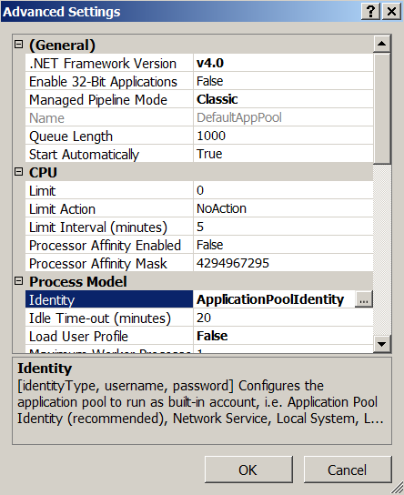

    1. Inside **Application Pool Identity**, select **Built-in account** and choose **LocalSystem** from the provided options.

        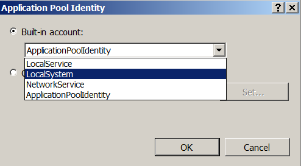

### Preparing the database to host the data of your applications

Your application data will be preserved either in the same databases/schemas and database server, or by moving the databases/schemas from the current database server to a new one.

If you're keeping the same database, follow the procedure in [Using the database that previously kept the OutSystems data](#use-existing-db). If you're moving to a new database server, follow the instructions in [Using a brand new database](#use-new-db).

#### Using the database that previously kept the OutSystems data { #use-existing-db }

OutSystems encrypts sensitive configuration data such as passwords. To secure that data, an encryption key was generated when you installed OutSystems.

That key is stored in the `private.key` file under the platform installation folder (`C:\Program Files\OutSystems\Platform Server`). To allow your application to decrypt sensitive data you need to ensure that it uses that key.

By default, your application will use the `private.key` file located in the Platform installation folder and after uninstalling it will be removed. For that reason, create a copy of the `private.key` file in a path where an IIS user can read and change the configuration file accordingly. To change the configuration file:

1. Locate the `machine.config` files for .NET Framework 4.0, on both the old and the new server, and open them with a text editor.

    **Note:** On 64-bit machines you should update both the 32 and the 64-bit configuration files. These are usually available in the following locations:

    `%WINDIR%\Microsoft.NET\Framework\v4.0.30319\CONFIG\`  
    `%WINDIR%\Microsoft.NET\Framework64\v4.0.30319\CONFIG\`  

1. Under `<appSettings>`, locate the `<add>` element with the key `"OutSystems.HubEdition.SettingsKeyPath(DEFAULT)"`.  
Change the `value` attribute of this element to point to the new location of the `private.key` file.

#### Using a brand new database { #use-new-db }

If you will use a new database, you have to manually reconfigure your database connection strings. To do this:

1. Locate the `machine.config` files for .NET Framework 4.0, on both the old and the new server, and open them with a text editor.

    **Note:** On 64-bit machines you should update both the 32 and the 64-bit configuration files. These are usually available in the following locations:

    `%WINDIR%\Microsoft.NET\Framework\v4.0.30319\CONFIG\`  
    `%WINDIR%\Microsoft.NET\Framework64\v4.0.30319\CONFIG\`

1. Change the connection strings under `<appSettings>`. You won't be able to use them since their value attribute is encrypted, hence the need to convert them to plain text format. These strings vary with the different database providers and are provided in [Connection strings](#connection-strings). There are 10 connection strings to declare. You can find them searching in the `key` attribute for the following values:

    * `OutSystems.DB.Logging.Application.Admin.ConnectionString`
    * `OutSystems.DB.Logging.Application.Runtime.ConnectionString`
    * `OutSystems.DB.Logging.Services.Admin.ConnectionString`
    * `OutSystems.DB.Logging.Services.Runtime.ConnectionString`
    * `OutSystems.DB.Platform.Application.Admin.ConnectionString`
    * `OutSystems.DB.Platform.Application.Runtime.ConnectionString`
    * `OutSystems.DB.Platform.Application.Session.ConnectionString`
    * `OutSystems.DB.Platform.Services.Admin.ConnectionString`
    * `OutSystems.DB.Platform.Services.Runtime.ConnectionString`
    * `OutSystems.DB.Platform.Services.Session.ConnectionString`
  
    Here's an example using SQL Server and one of the connection strings:

        <add key="OutSystems.DB.Logging.Services.Runtime.ConnectionString"
            value=" User ID={LogUser};Password={LogPassword};Data Source={Server};Initial Catalog={Database}; />

    Depending on the connection string, you must use the corresponding user and password. For the example given, the Log user was used since it was the one referenced.  

1. In the OutSystems database, find the `OSSYS_DBCONNECTION` table. You need to update the `DATABASE_CONFIGURATION` connection string since it's encrypted by OutSystems. Use the same user that is configured in Service Center for that Database Connection. Change the connection string to the following format:

        ProviderKey=SqlServer
        <DBConfiguration><ConnectionStringOverride>{CONNECTION_STRING_IN_PLAIN_TEXT}</ConnectionStringOverride></DBConfiguration>

    To create a correct `{CONNECTION_STRING_IN_PLAIN_TEXT}`, check [Connection strings](#connection-strings).

## Detaching an application from OutSystems { #detach-app }

This chapter covers how to detach, compile, and deploy a single module.

To have a system that replicates your previous factory, you must deploy all the applications published by OutSystems. This way you guarantee that all dependencies are met, further reducing the chances of failure.

Since there are some specific OutSystems applications for application and environment configuration and management, like Service Center and LifeTime, those can't be detached.

If your OutSystems platform is running on the OutSystems PaaS, to detach the source code of your applications, first you need to build a hybrid deployment, where you installed one OutSystems environment either on-premises or on another public cloud.

<div class="info" markdown="1">

You must follow all the steps described in this section for a successful detach of all modules. This includes OutSystems modules that your applications most likely depend on, like RichWidgets and Users applications.

</div>

### Get the source code of web applications { #source-code-web }

To obtain the source code of a web application module, open the **Licensing** page under the **Administration** tab in Service Center and detach the source code as follows:

1. Click on the **Modules Source Code** link.

    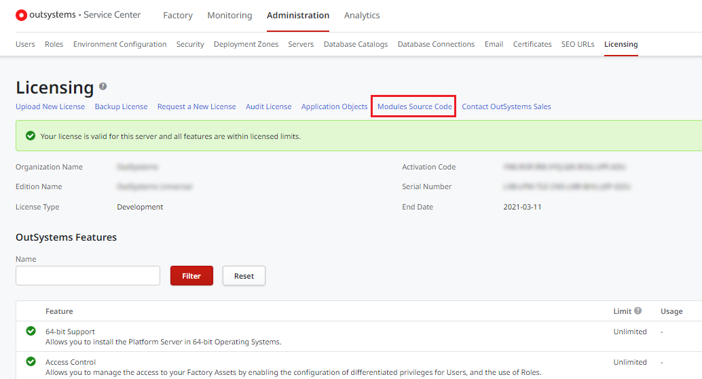  

1. Click **Detach** for the module whose source code you want to obtain.

      

1. Wait until OutSystems has finished packing the module source code and click **Download**.

    

1. Save the ZIP file and extract it.

### Get the source code of mobile apps  { #source-code-mobile }

To fully detach a **mobile** app from OutSystems you need to:

* Detach the back-end source code of the mobile app by following the same procedure outlined in [Get the source code of web applications](#source-code-web), selecting the module corresponding to your mobile app when doing the detach.

* Detach the native app source code used to build the installable APK or IPA application package (known as the "native shell") by following the procedure presented below.

You need to obtain and deploy/build these two detached components to get a fully working mobile app detached from OutSystems.
  
To obtain the native app source code of an Android or iOS mobile app, open the **Applications** page under the **Factory** tab in Service Center and proceed as follows:

1. Search for the application corresponding to your mobile app and click on its name to go to the detail page.

    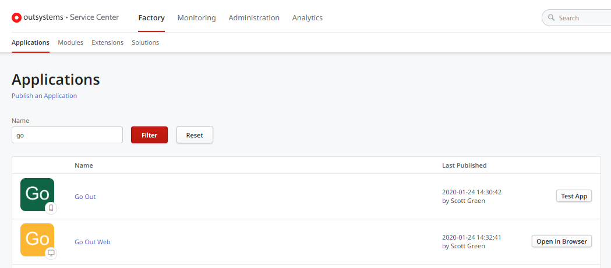  

1. In the **Native Platforms** tab click in the **Download source code** icon for the desired platform build (Android or iOS).

    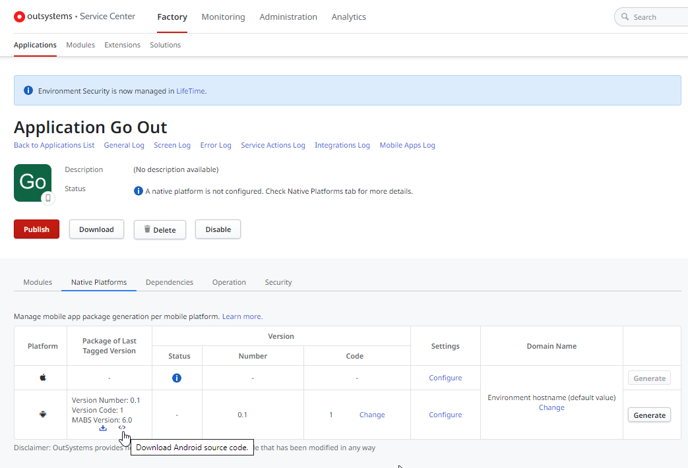

1. Save the `tar.gz` file and extract it.

The obtained source code corresponds to the source code of the most recent build of the mobile app for the selected platform.

**Note:** The mobile app source code is only kept for 7 days after a successful build. You'll need to generate the mobile app again if the last build was made more than 7 days ago.

### Compiling and deploying web applications { #compile-web }

Before you open the application's solution in Visual Studio, you need to make sure that no application or module publication has occurred in the local machine or otherwise you'll get errors. To do this, check for any existing application publication data in Internet Information Services (IIS) and clear it out with the following steps:

1. From the Windows Start Menu search for **IIS** and open it.

1. In the left pane tree expand the following items:

    **&lt;your machine name&gt;** > **Sites** > **Default Web Site**

      

1. Look for a virtual directory () with the same name as the module you have detached and remove it; either by clicking on it and then pressing the **Del** key, or by right-clicking on it to open the popup menu and then choosing the **Remove** option.

    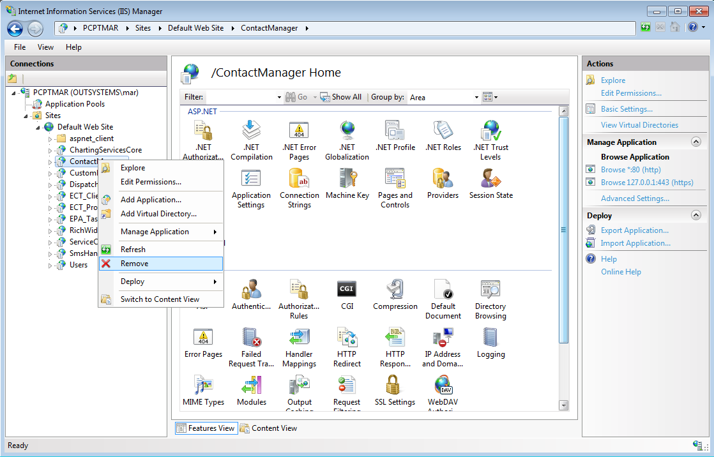

If your application uses the OutSystems SAP plugin, then the SAP .NET Connector libraries have to be manually added to the detached source code. To ensure that the application compiles successfully, you need to copy the `sapnco.dll` and `sapnco_utils.dll` files, located in the `\thirdparty\lib\` folder in the Platform Server installation directory, into the `ThirdParty\SAP` folder that came with the detached source code.

To deploy applications to IIS, you need Visual Studio 2017 15.9.7+ with the following workloads and components:

* .NET desktop development workload
* ASP.NET and web development workload
* .NET Core cross-platform development workload
* .NET Framework 4.7.2 SDK and targeting pack individual components

To deploy your applications, proceed as follows:

1. Open the `<Project Name>.sln` file provided in the extracted source code of the detached application.

1. Execute the Visual Studio's **Build Solution** command to compile your application.

1. Execute the Visual Studio's **Publish &lt;Project Name&gt;** command to publish your application to IIS by creating a **Custom** profile. When asked, choose the **Custom** option and give a name to the profile.

    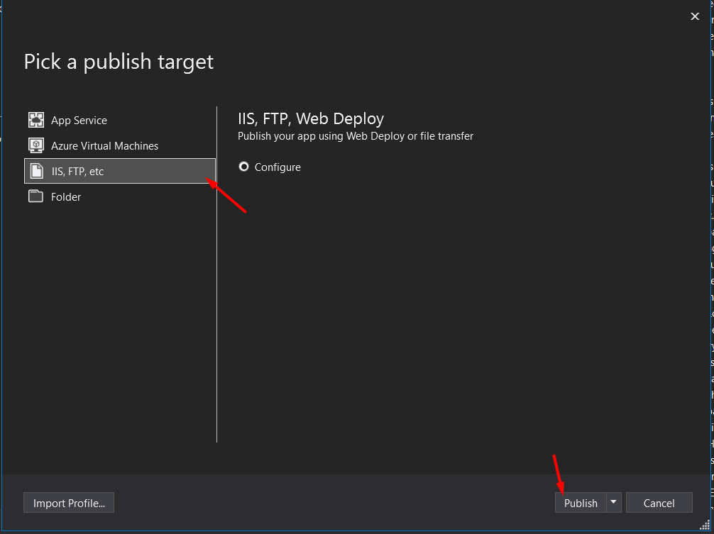

1. Configure the new profile and press **Save**.

      

1. After a successful publication, open IIS and search under your **Default Web Site** for the virtual directory with the name of your published module and click on it.

1. Make sure that your application is running under an Application Pool that uses .NET 4.0.  
To change the application pool of the underlying web site, select the web site and in the **Actions** pane click **Basic Settings**. Click **Select**, and select an application pool configured to use .NET 4.0.

1. Locate the application configuration file, `appSettings.config`, present on deployment folder and change database connection strings:

    1. Open IIS, right-click over the desired application and select **Explore** option.
    1. Open the `appSettings.config`.
    1. Change connection string configurations like you did for `machine.config` (check [Using a brand new database](#use-new-db)).

### Compiling and deploying mobile apps { #compile-mobile }

<div class="info" markdown="1">

**Before you start**

If you detached the back-end source code of the mobile application and deployed it outside OutSystems, update the back-end endpoint in the following files, according to the mobile platform:

For Android:  
`<extract_path>\source\config.xml`  
`<extract_path>\source\platforms\android\app\src\main\res\xml\config.xml`

For iOS:  
`<extract_path>\source\config.xml`  
`<extract_path>\source\platforms\ios\<app_name>\config.xml`

Change the following entries in the configuration files identified above:  

`<content src="https://<new_endpoint_hostname>/MyAppName/" />`  
`<preference name="DefaultHostname" value="<new_endpoint_hostname>" />`

</div>

#### Android mobile apps

To build a detached Android mobile app you need:

* [Android Studio](https://developer.android.com/studio/index.html) installed in your computer.

* **Android SDK** (it should have been installed together with Android Studio).

* _(Optional)_ **Your own keystore to sign generated app packages (APKs)** . If you don't use a specific keystore, a default keystore will be used to sign the app. You may encounter issues in updating applications when you generate the mobile app in different machines without using your own keystore, since each machine has its own default keystore.

Build your Android app by following these steps:

1. Open Android Studio.

1. Click **Open an existing Android Studio project** option and select the `<extract_path>\source\platforms\android` folder.

1. When the Gradle sync operation finishes, choose **one** of the following:

    * **Build** > **Build APK** menu option to generate an application package signed using a **default keystore**.
    * **Build** > **Generate Signed APK...** to generate an application package signed with **your own keystore** (you will be asked for some data related to the keystore).

#### iOS mobile apps

To build a detached iOS mobile app you need a Mac with [Xcode](https://developer.apple.com/xcode/) installed. You also need an Apple Developer or an Apple Enterprise Developer account to test your mobile app on an real iOS device.

To build the app and run it on your device, do the following in Xcode:

1. Open the `<your_application_name>.xcodeproj` project file available in `<extract_path>\source\platforms\ios` folder;

1. Make sure that your Apple ID is correctly set up in Xcode so that it's associated with your Apple Developer account.

1. Make sure that you have defined your team (set it in **Project editor** > **General**). If your Apple Developer account doesn't have any provisioning profiles or certificates yet, Xcode should create a team provisioning profile and a development certificate for you.

1. Connect your iOS device to your Mac.

1. Select your connected device as the target in the **Scheme** toolbar menu.

1. Click **Run**.

Xcode builds and installs the app on the device and then launches it.

### Custom database plugins

OutSystems already includes database plugins that come within the source code of the detached application. In case of having custom plugins, put those inside the `<your_application_name>\bin` folder of the detached application. In Visual Studio add a reference from the detached project to the database provider assembly that you just copied to the bin folder.

### Extensions

Extension modules don't generate source code. As such, source code for custom extensions are always available for detachment and reuse. Just use Integration Studio, as usual, to open and compile the source code using Visual Studio.

### Microsoft Excel files

If your application handles, either reads or writes, data stored in MS Excel files, you must change the `SetLicense()` method.

To setup the professional license you need to:

1. Find the `SetLicense()` method on `RuntimePlatform\GemBoxLicensing.cs` and set the method to use your own Gembox Spreadsheet license.

1. Request from GemBox a DLL for the GemBox Professional version.

1. Go to the detached source code solution and, in **References**, replace the GemBox free version DLL with the Professional version DLL. Do this in both `RuntimePlatform` and application projects.

In case of not having such a license, you can use the limited Gembox Spreadsheet free edition. Although this license offers the same performance as the paid version, there are limitations in the number of rows per sheet, and the number of sheets per workbook. You should investigate these values further, since they're subject to change.

### Managing .NET references

When publishing an application, OutSystems automatically compiles that specific module and also its references. It then propagates the files generated from the referenced application to the application that references them.

Take as an example application A that uses a web block of application B. Application B is referenced by application A. When publishing application A, first OutSystems compiles application B and uses the files generated in that compilation to be used as reference to application A. Only then does OutSystems compiles and deploys application A.

When you detach an application, you lose this automatic procedure and you will need to perform those steps (either manually, creating scripts or by managing references through Visual Studio). This means that, after you detach, when you modify application B and then publish application A without any other action, the changes made were not reflected.

To manage the references manually:

1. Compile the referenced application, in this case only application B.
1. Go to the `Application B\bin` folder and copy all the `.dll` files.
1. Paste the content in the `Application A\bin` folder.

Now application A is ready to be compiled and deployed. This procedure is the same as described previously, according to the application type:

* For web applications, check [Get the source code of web applications](#source-code-web) and [Compiling and deploying web applications](#compile-web).
* For mobile apps, check [Get the source code of mobile apps](#source-code-mobile) and [Compiling and deploying mobile apps](#compile-mobile).

If an application depends on another applications, you might need to deploy all its dependencies to guarantee that it keeps working correctly.

### Container Hosting Technologies

When publishing an application to a Deployment Zone configured with a supported Container Hosting Technology (Docker Container, Amazon ECS, Azure Container Service, and Pivotal Cloud Foundry), OutSystems automatically generates an archive with the application files, all the necessary artifacts to deploy that application to the selected technology and the unified configuration file for the application's modules and its Application Scheduler.

When you detach an application, you lose the automatic creation of these artifacts. We recommend that before detaching an application, you publish any application to a Deployment Zone with the desired Container Hosting Technology so that you have access to the necessary artifacts.

However, to have an application running on a container some modifications to these artifacts will be required.

#### Docker-based technologies

<div class="info" markdown="1">

This procedure applies to Docker Container, Amazon ECS, and Azure Container Service.

</div>

Before you start, follow the steps in [Compiling and deploying web applications](#compile-web) so you have your application compiled and ready to deploy. The generated archive for Docker-based technologies has the following structure:

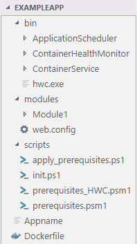

Your archive will be different since the folders inside the `modules` folder are dependent on the modules an application has.

To deploy your detached application to a Docker container, follow these steps:

1. In the generated archive, delete all folders inside the folder `modules` but keep the `web.config` file.

1. Delete all folders inside the `bin` folder but keep the `hwc.exe` file.

1. _(Optional)_ Delete the `Appname` file.

1. Copy the folder with your application binaries to the `modules` folder.

1. Replace the code in the `init.ps1` file with the following:

        $env:PORT=80
        Stop-Service -Name w3svc
        c:/bin/hwc.exe -appRootPath modules -multipleApps true

1. Build a Docker image using the Dockerfile and spin up the containers running the application.

#### Pivotal Cloud Foundry

Before you start, follow the steps in [Compiling and deploying web applications](#compile-web) section so you have your application compiled and ready to deploy.
The generated archive for Pivotal Cloud Foundry (PCF) has the following structure:

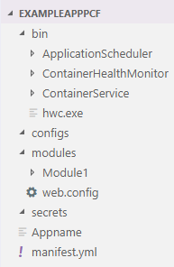

Your archive will be different since the folders inside the `modules` folder are dependent on the modules an application has.

To deploy your detached application to a PCF container, follow these steps:

1. In the generated archive, delete all folders inside the folder `modules` but keep the `web.config` file.

1. Delete all folders inside the `bin` folder but keep the `hwc.exe` file.

1. _(Optional)_ Delete the `Appname` file, the `configs` folder, and the `secrets` folder.

1. Copy the folder with your application binaries to the `modules` folder.

1. In the `manifest.yml` file, replace the line starting with `command` with the following:

        command: bin/hwc.exe -appRootPath modules -multipleApps true

1. Push your application to PCF and run it.

## Final steps { #final-steps }

When all applications have been successfully published, it's recommended that you test everything first before uninstalling OutSystems Platform Server. If you moved from Application Server, skip the [Before uninstalling](#before-uninstall) and test your applications, since no uninstallation needs to be performed.

### Before uninstalling { #before-uninstall }

If no error was found there's a great chance you followed everything correctly, nevertheless some errors may appear when you uninstall the OutSystems Platform Server. To safely test this without having to reinstall everything follow this steps:

* Stop all OutSystems services.

* Store a copy of `C:\Program Files\OutSystems\Platform Server` on another location. After that, you can either change the name of `C:\Program Files\OutSystems\Platform Server`, for example to `C:\Program Files\OutSystems1\Platform Server`, or delete this folder.

This way you can simulate an uninstall and you should be able to access all your applications.

### Testing

Test your application extensively to guarantee no errors are found. If any issue is found, repeat all the steps to confirm that you didn't miss any. If the error persists, contact OutSystems Support.

When you are sure everything is working correctly and no OutSystems files are present (other than the ones we asked you to keep), you have successfully performed the detach.

If you changed the name of the folders where OutSystems server was installed, to uninstall you must change the names back to the original values.

## Appendix

### Connection strings { #connection-strings }

When you need to convert your connections string to plain text, use the corresponding string according with your database provider(s).

An example is provided so that you can easily map the placeholders from the **Configuration Tool**, which can be found under **Windows Start Menu** > **OutSystems** > **Administration Tools**.

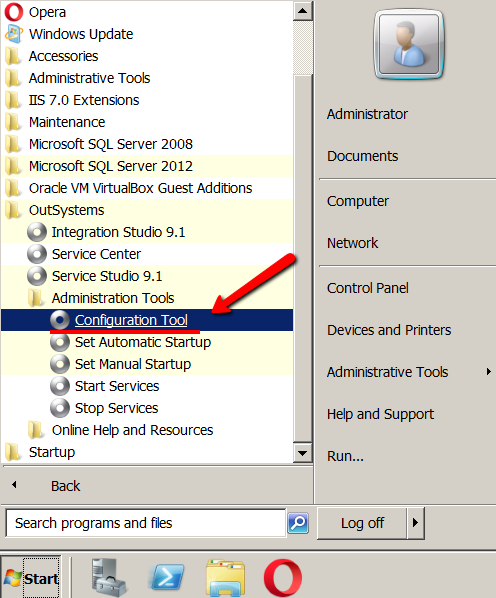

If it's an external database connection, you can get the same information accessing **Service Center** > **Administration** > **Database Connections**, since the names are exactly the same.


Don't forget to change the placeholders, wrapped around curly brackets `{}`, with your own information. Also, each connection string refers to a different User; this mean that for each string you must check which User it refers to.

#### SQL Server / Azure SQL Database

```
User ID= {User}; Password= {Password};Data Source= {Server}; Initial Catalog= {Database};
```


#### Oracle

```
User ID= {User}; Password= {Password}; Data Source= (DESCRIPTION=(ADDRESS=(PROTOCOL=TCP)(HOST= {Host} )(PORT= {Port} ))(CONNECT_DATA=(SER VICE_NAME= {Service Name} )));
```


#### iDB2

```
DataSource= {Server}; Database= {Database}; UserId= {Username}; Password= {Password}; Def aultCollection= {Schema};
```

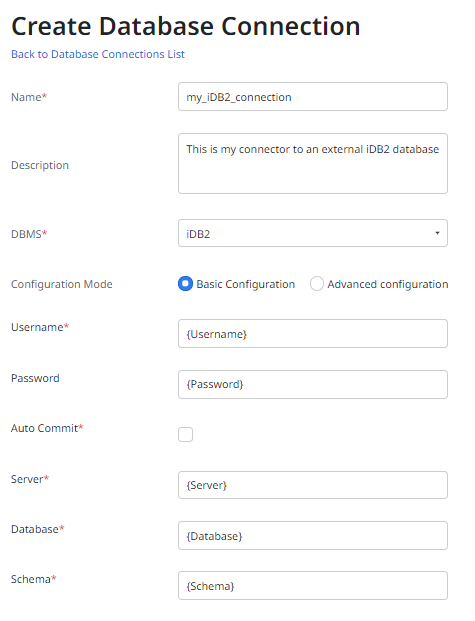

#### MySQL

```
Server= {Server}; Database= {Schema}; Uid= {User}; Pwd= {Password}; Allow User Variables=true; ConnectionLifeTime=6000; ConnectionReset=true;
```

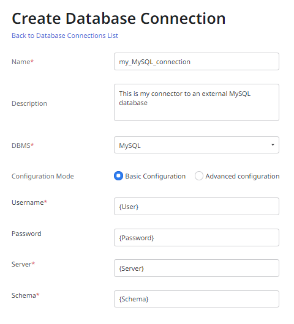
