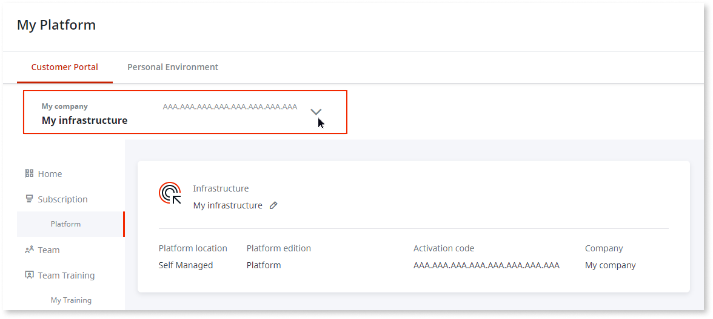

---
summary:
en_title: 05 How to free up an existing environment in licensing
---

# How to free up an existing environment in licensing

This article explains how you can remove an environment in the [Licensing Portal](https://www.outsystems.com/licensing/) - an operation which is relevant when your team is performing the following operations:

* upgrade your OutSystems Platform infrastructure; 

* transfer an OutSystems Platform environment across servers;

* change server hardware;

* sunset an existing OutSystems Platform environment

If you need assistance while installing and managing your server licenses [contact OutSystems Support](https://success.outsystems.com/Support/Enterprise_Customers/OutSystems_Support/01_Contact_OutSystems_technical_support).

## Releasing an existing environment

Access the [Licensing Portal](https://www.outsystems.com/licensing/) and select your infrastructure:

Look up the environment for which you want to get a new license file (making sure that the serial number matches):

To get a new license you will have to release this environment (dissociating it from the previous serial number):

* click '**Release Environment**';

* fill in the reason for the license invalidation;

* click **'Release'**

If your infrastructure as been flagged for abuse the environment release will not be immediate: it will trigger a request to OutSystems licensing to review your request.

## More information

* [How OutSystems licensing works](../overview/how-licensing-works.md)

* [Changed the hardware and the license stopped being valid](../troubleshooting/change-hw-license-invalid.md)

* [Registering your environment (using the serial number)](get-license-for-env.md#register-env-serial-number)
