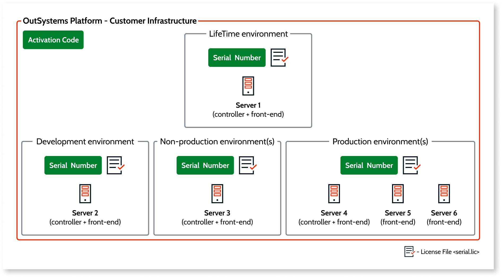

# How OutSystems licensing works

You may subscribe to OutSystems Cloud or use a self-managed infrastructure. A typical infrastructure has several environments like Development, Quality Assurance, and Production. The OutSystems management console (LifeTime) also requires a dedicated environment.

Each OutSystems subscription has a unique [Activation Code](https://success.outsystems.com/Support/Enterprise_Customers/Licensing/Overview/01_How_OutSystems_Platform_licensing_works#What_is_an_Activation_Code.3F) that contains information about your subscription. And each environment has a unique [Serial Number](https://success.outsystems.com/Support/Enterprise_Customers/Licensing/Overview/01_How_OutSystems_Platform_licensing_works#What_is_a_Serial_Number.3F_How_does_it_relate_to_the_Activation_Code.3F) that identifies it.

## Frequently asked questions

### What is an Activation Code?

An Activation Code is the unique identifier of your subscription. It has information about the configurations and features you've subscribed, such as:

* The number of users you can have;

* The number of environments you can have;

* The features available;

* The support level you have;

* The end date of your subscription.

Your Activation Code won't change regardless of any changes to your subscription. As an example, even if you acquire more environments or change your support level, your Activation Code remains the same.

### What's a serial number, and how does it relate to an Activation Code?

A Serial Number is a unique identifier of an environment.

All your environments have the same Activation Code, and each environment has a unique Serial Number. The Serial Number is hardware-based and automatically generated by the server assigned as controller of that environment.

### I have multiple servers on an environment. Do I need multiple licenses?

No you don't. OutSystems is designed for fault tolerance and horizontal scalability, so there isn't a limit on the number of servers for any given environment.

### Do I need a license for the development tools?

No you don't. You only need a license for your cloud or on-premises infrastructure, not the development tools.

### Where do I get my license files?

With the Activation Code of your infrastructure at hand you can download your license files from the [Licensing portal](http://www.outsystems.com/licensing). Check [here](https://success.outsystems.com/Support/Enterprise_Customers/Licensing/02_Manage_and_Upgrade/03_Get_a_license_file_for_an_environment) for the instructions on how to get and install a license file.

### How to find out what my subscription includes?

[Check the Licensing portal](http://www.outsystems.com/licensing). There you can find all about your current subscription.
