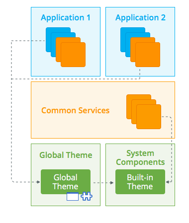

# Isolating an application Theme

In an enterprise installation, applications usually share the same corporate look & feel. Being a shared component, it is key to correctly position a global Theme module in the enterprise architecture.

A Theme module includes the following components:

* The theme itself (the CSS)

* Layout *Blocks,* to define screen or screen section patterns

* Logo images

*  Login flow and exception handling

*  Menu and navigation support logic

* Transversal roles (normally job roles like Manager or Employee) that can be reused in any application. This roles may influence the menu entries to be displayed.

The Theme module should be restricted to global look & feel elements and never be used as a global repository of assets and utilities.

## Same look and feel, menu and login flow

The following example shows a Global theme that is reused by several applications, supplying a common menu and login flow. This scenario makes sense if all the applications belong to a common Portal.

It is based on one of the built-in themes supplied in OutSystems UI.

If the Common services supply UI components (*Blocks*), they should be based on the built-in base theme, since they are reusable by other applications that might be using a different look & feel.

A *Block* will assume the CSS of the consuming module, thus adapting to the look & feel of the final application.

Services inside each application are specific for that application, hence they can safely use the Global theme.

## Same look and feel, different menus and login flows

If the applications are independent from each other and all they need is to share the global look & feel, then each application must have its own theme module.

In this case, each application theme inherits the common global theme, but defines its own menu and/or login flow.

Any overall change to the look & feel is performed in the Global theme module. Specific menus and login mechanisms (integrated, federated, different user provider, among others) are specialized in each application theme.

## More information

To learn more about how to design your application architecture check the [Designing the architecture of your OutSystems applications](https://success.outsystems.com/Support/Enterprise_Customers/Maintenance_and_Operations/Designing_the_architecture_of_your_OutSystems_applications) guide.

You can also check for further recommendations on how you should [compose your application landscape](https://success.outsystems.com/Support/Enterprise_Customers/Maintenance_and_Operations/Designing_the_architecture_of_your_OutSystems_applications/Application_composition).
