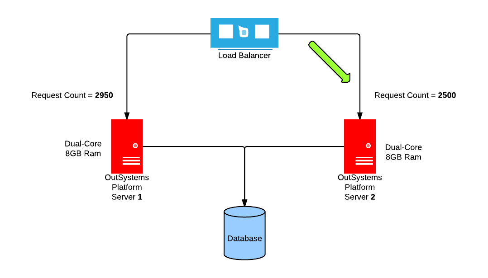
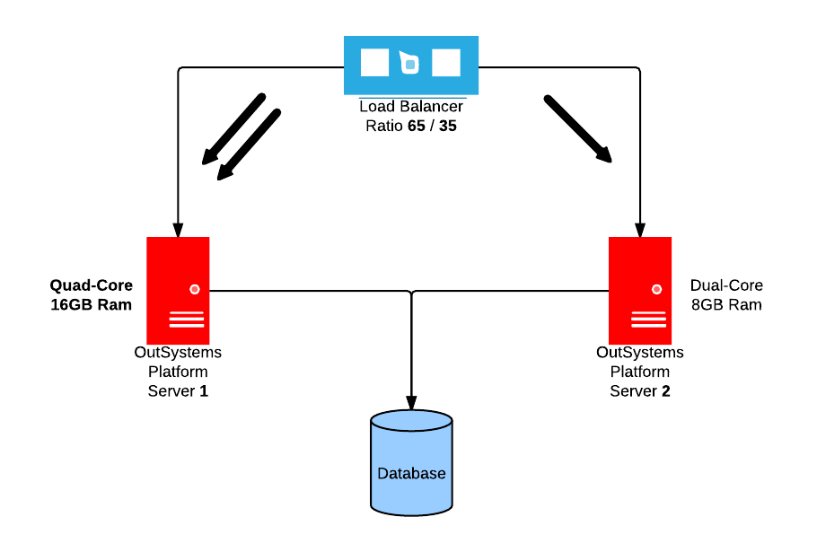

---
summary:
en_title: 01 Recommended configurations for Load Balancing
---

# Recommended configurations for Load Balancing

OutSystems Platform supports both **layer 4** and **layer 7** load balancers. This is possible since the session model is stored in a centralized database which is accessed by all the Front-ends. Therefore, requests from individual end-users can be distributed across Front-ends without any impact.

OutSystems strongly recommends the use of a load balancer that doesn’t manipulate the traffic in any way.

If a layer 7 load balancer is available, it can be used for a more intelligent load validation if it doesn’t manipulate traffic. Within the layer 4 load balancing scope, there are several techniques to guarantee an effective distribution of the load.

## Global Layer 4 / 7 Load Balancers

### Round-robin (**Recommended**)

 

Requests are processed sequentially in a circular manner. [Front-end machines have the same hardware configuration](https://success.outsystems.com/Support/Enterprise_Customers/Maintenance_and_Operations/Designing_OutSystems_Infrastructures/02_Sizing_OutSystems_Platform), equal number of applications and the same target audience.

### Least Connections

[Front-end machines have the same hardware configuration](https://success.outsystems.com/Support/Enterprise_Customers/Maintenance_and_Operations/Designing_OutSystems_Infrastructures/02_Sizing_OutSystems_Platform). The connection requests are sent to the server with least connection requests.

### Ratio

[Front-end machines have different hardware configuration](https://success.outsystems.com/Support/Enterprise_Customers/Maintenance_and_Operations/Designing_OutSystems_Infrastructures/02_Sizing_OutSystems_Platform), equal number of applications and the same target audience. The load balancing is based on a ratio where the more powerful server receives a larger number of connection requests,

The ratio load balancer can also be dynamic, where several monitoring checks are actively done to gather server performance and decide on the best node to serve the connection request.

### Specifics for Layer 7

Load balancers with Layer 7 capabilities have a mechanism to manage user sessions (sticky sessions) and it should **not **be used in OutSystems web-farms to avoid uneven load distribution. OutSystems Platform itself manages all user sessions in the session database.

Sticky session refers to the feature of many load balancing solutions for web-farms to route the requests for a particular session to the same physical machine that serviced the first request for that session. This is mainly used to ensure that a session is not lost as a result of requests for a session being routed to different servers. Since requests for a user are always routed to the same machine that first served the request for that session, sticky sessions can cause uneven load distribution across servers.

## More information

To learn more about how to load balance your OutSystems Platform check the [Load Balancing OutSystems Applications](https://success.outsystems.com/Support/Enterprise_Customers/Maintenance_and_Operations/Load_Balancing_OutSystems_Applications) guide.

