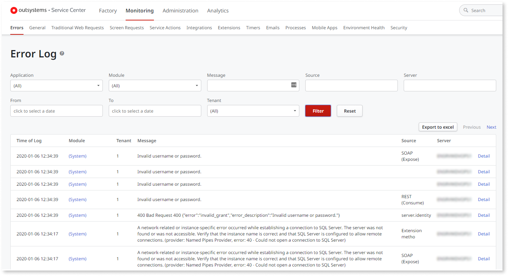
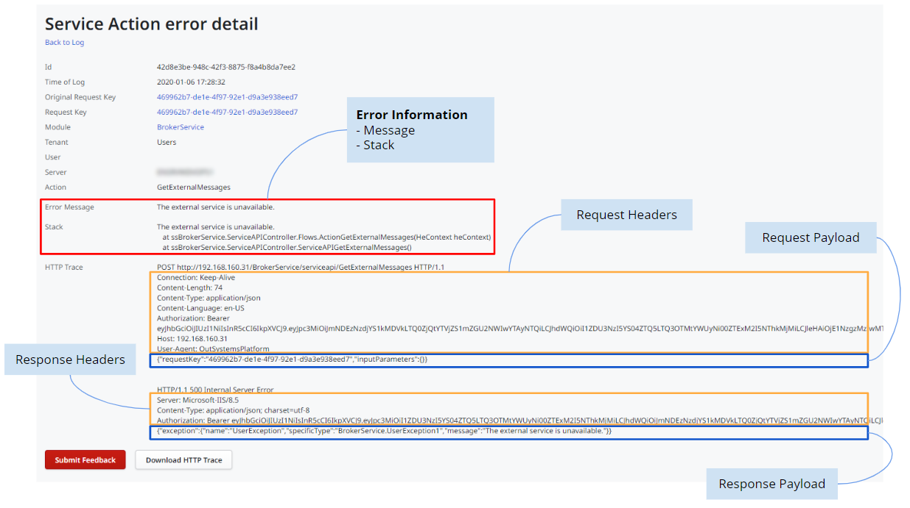
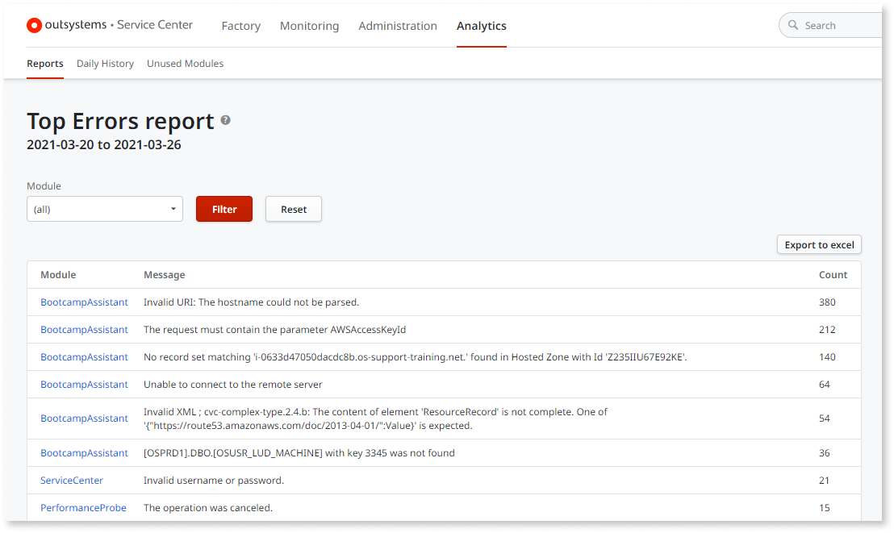
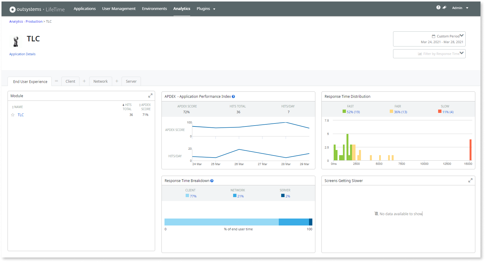
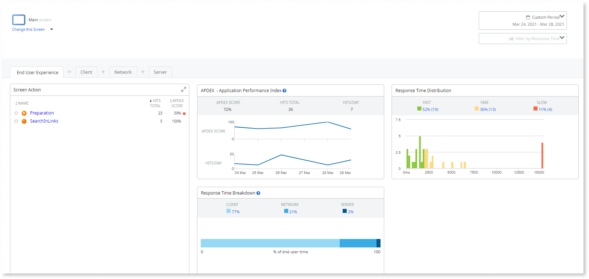
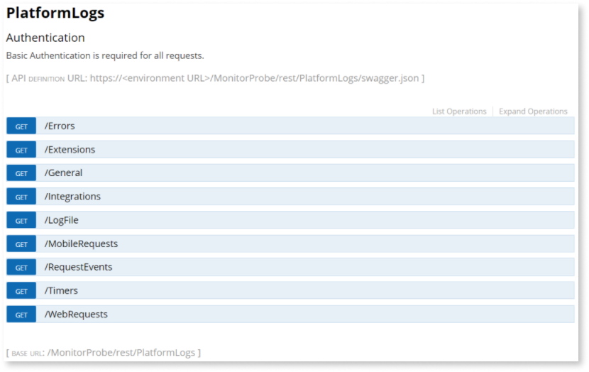
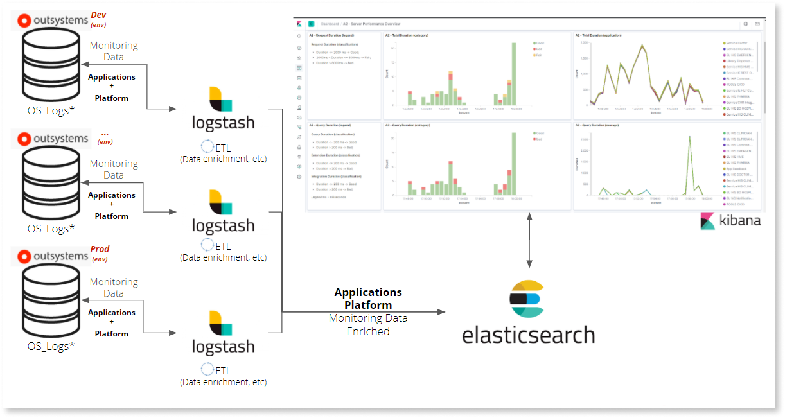

# Monitoring OutSystems applications

OutSystems provides built-in monitoring and analytics tools that enable proactive management of application performance to make it easier to detect, identify, and troubleshoot issues in real time.

These tools are automatically available through the platform, and all OutSystems applications are instrumented to collect logs and performance events and store them in a standard relational database. These metrics are collected by default, requiring no extra work on the part of developers and adding no overhead to the runtime environment.

OutSystems makes more than a dozen monitoring logs available for analysis and troubleshooting. Aside from providing comprehensive reports by type and time window, developers can also use analytics dashboards to spot bottlenecks on the client, network, and server that negatively impact [APDEX](https://success.outsystems.com/Documentation/11/Managing_the_Applications_Lifecycle/Monitor_and_Troubleshoot/The_APDEX_Performance_Score) values. Once these issues are identified they can be followed up for resolution. 

A great number of monitoring and troubleshooting use cases can be served by the out-of-the-box tools. However, OutSystems demonstrates its strength as a development platform by making it easy to integrate this wealth of logged data with leading industry-strength monitoring and analysis platforms provided by third-party vendors.

## OutSystems monitoring tools

Before exploring use cases let’s briefly mention the built-in monitoring and analysis included in every OutSystems installation:

* [Service Center](https://success.outsystems.com/Documentation/11/Managing_the_Applications_Lifecycle/Monitor_and_Troubleshoot/View_the_Environment_Logs_and_Status) provides monitoring logs and analytics reports about performance issues of the platform and applications.
* [LifeTime](https://success.outsystems.com/Documentation/11/Managing_the_Applications_Lifecycle)  gives an aggregated  view into Web application performance and end-user experience.
* [Performance Monitoring API](https://success.outsystems.com/Documentation/11/Reference/OutSystems_APIs/PerformanceMonitoring_API) provides access to detailed performance data of request events and deep analysis of performance issues.
* [App Feedback](https://success.outsystems.com/Documentation/11/Managing_the_Applications_Lifecycle/Gather_user_feedback/Enable_user_feedback_for_apps) can be enabled in LifeTime so key users, during the acceptance stage, deployment, and after release, can send suggestions or report problems.
* [Asynchronous Logging API](https://success.outsystems.com/Documentation/11/Reference/OutSystems_APIs/Asynchronous_Logging_API) can be used in your OutSystems applications for more advanced monitoring by referencing the  module which provides actions.
* [Business Activity Monitoring](http://www.outsystems.com/forge/component/132/business-activity-monitoring/) enables developers to start monitoring and optimizing processes immediately after deployment without the need for any development effort.

### OutSystems-supported components { #outsystems-supported}

OutSystems supports quick and easy integration with monitoring and analysis dashboards available through [Firebase plugins](https://www.outsystems.com/forge/Component_Documentation.aspx?ProjectId=4991&ProjectName=firebase-mobile) for the following services:

* [Firebase Crashlytics](https://firebase.google.com/products/crashlytics), a real-time crash reporting tool for prioritizing and fixing crashes based on the impact on real users.
* [Google Analytics for Firebase](https://firebase.google.com/products/analytics) provides free, unlimited reporting on key events and user properties.
* [Firebase Performance Monitoring](https://firebase.google.com/products/performance) gives insight into app performance from the user point of view with detailed trace and network data.

**Note**: OutSystems-supported plugins are scheduled for official release in April 2021.

### Community-supported components 

You can enhance the functionality and capabilities of the monitoring data collected by OutSystems through extensions that are available through the [OutSystems Forge](https://www.outsystems.com/forge/), a repository of thousands of open-code libraries, plugins, and pre-built components that you can use as-is or modify to suit your particular needs.

The Forge includes accelerators that can be used to create connectors to integrate OutSystems data logs with many major third-party tools, providing additional monitoring dashboards, deep data drill-downs, sophisticated analysis functionality, and real-time alerts.

### Other monitoring and analysis options

Many developers make use of freely available web-based tools, along with free versions offered by major third-party vendors, including:

* [Webpagetest.org](http://webpagetest.org)
* [web.dev](https://web.dev/measure/)
* [Elastic](https://www.elastic.co/downloads/)
* [Grafana](https://grafana.com/)
* [Microsoft Power BI](https://powerbi.microsoft.com/en-us/get-started/)

## Use cases

There is no "one size fits all" solution for monitoring and analysis. Every enterprise has specific requirements, and these requirements differ among  the various apps released for different target audiences. Building a useful monitoring and analysis toolkit involves balancing stakeholder interests, operational concerns, and business goals, including some of the following:

* **DevOps**: real-time monitoring aiming for app availability
* **Team leader**: proactive monitoring with performance trend analysis
* **Product owner**: user engagement, and an omnichannel user journey
* **Product developer**: customer experience analysis
* **Business analysis team**: outcome analysis, user satisfaction/sentiment, and feedback

The same power that OutSystems provides for app development also delivers flexible solutions to fine-tune performance strategies after production. However, the wide range of monitoring and analysis options that OutSystems makes available, when combined with the variety of apps built with the platform, each with its own needs and requirements, makes it difficult to present a useful set of use cases, since a comprehensive list might end up being as long and varied as the number of OutSystems customers.

To provide focus, this article explores sample use cases from the following categories:

* [Workgroups apps](#workgroup-apps)
* [Departamental apps](#departmental-apps)
* [Enterprise apps](#enterprise-apps)

Each use case describes a sample best-practices path toward optimal monitoring and analysis solutions using different combinations of built-in tools, enhancements, and extensions.

While the workflows shown below may not include a perfect template for your own monitoring and analytics needs, the variety of challenges presented and the flexibility of implementation described should allow you to mix and match solutions in order to achieve optimal results.

### Workgroup apps { #workgroup-apps }

A workgroup app is designed for, and used by, company employees, for a wide variety of internal activities, from browsing through an office directory to choosing a take-in entree for lunch. Because less than optimal performance has low impact on revenue or on the organization brand, such apps are often classified as non-critical. 

However, non-critical does not mean unimportant. And though a workgroup app is designed for employees, that person is also a user—and as such deserves a good user experience.  So this means that they require monitoring and performance analysis. The question is only how much, and how fast:  how many resources and how big of a budget should be allocated for this task.
The following workgroup app use cases are considered:

* **RSVP**: Meeting organizer
* **On the Move**: Vacation scheduler
* **T**ender **L**oving **C**are: Sick employee call in

#### RSVP app

**RSVP** is a meeting organizer that includes the following functionality:

* Checking availability of attendees
* Scheduling a conference room
* Reserving equipment
* Managing invites and acceptances
* Providing links to the agenda and other resources
* Sending reminders

The **RSVP** app requires access to the company calendar, an internal database of resources and equipment, and the location for online documents. As such, operational monitoring is important, including such issues as server memory, application speed, and application errors.
The monitoring needs for the RSVP app can be met by scanning error logs every day in Service Center, as follows.

##### Service Center { #service-center }

Service Center includes logging information about main indicators, including those in the following list:

* Error volume
* Slow extensions
* Slow queries
* Integration performance and availability
* Screen performance;
* Timers and BPT execution insights

For the **RSVP** app Service Center is consulted daily for logged errors, slow queries, integration problems, and sluggish screen actions in order to troubleshoot any areas of concern.

Log into [Service Center](https://success.outsystems.com/Documentation/11/Managing_the_Applications_Lifecycle/Monitor_and_Troubleshoot/View_the_Environment_Logs_and_Status) and select the Monitoring menu to view the Error Log.

Each log entry is identified by a timestamp, the module where the error occurred, the actual error message, and a Detail link to view additional information.

The **Error detail** page includes the error ID, the session ID, environment information, and a stack trace.

In addition, the **Request Key** can be used to correlate all log and performance events. Click it to see the Request Log.

Here you can see that a particular web screen request generated two different errors, both in the same module. You have identified a probable source for this particular error; now your developers know where to go to begin fixing it.
Other Service Center monitoring logs include:

* **General**: System and application activity
* **Traditional Web Requests** and **Screen Requests**: Server delays
* **Service Actions**: Service action delays
* **Integrations**: Execution delays of the actions of exposed and consumed integrations
* **Extensions**: Extension action delays
* **Timers**: Asynchronous logic irregularities
* **Emails**: Application logic involved in sending emails
* **Processes**: Business process errors
* **Mobile Apps**: App packages requested per application
* **Environment Health**: Status of the OutSystems services, asynchronous tasks, and environment.
* **Security**: Blocked IP addresses

#### On the Move app

**On the Move** is a vacation scheduler that includes a number of similar functions to the RSVP app, with the addition of an approval process that may involve several people before the vacation can be scheduled. So, in addition to the operational monitoring described above, daily checking of Service Center Analytics is added.

##### Service Center Analytics { #service-center-analytics }

For the **On the Move** app Service Center Analytics is consulted daily to view a number of pre-aggregated reports, all of which can be filtered by type and by date.

Among the most useful reports is **Top Errors**, arranged according to the number of errors and the module in which the errors occurred.

By clicking through to the module you can pinpoint the source of the problem and begin the process of correcting the error.

#### Tender Loving Care app

**TLC** (**T**ender **L**oving **C**are) is an app designed for employees to call in sick from home and for notifying interested parties as to their absence.  Because this app requires access outside of a company intranet, additional security is provided, and monitoring must include app functionality and user access.
So, in addition to the monitoring steps described above, daily checking of LifeTime analytics is included in the monitoring and analysis protocol.

##### LifeTime analytics { #lifetime-analytics }

While Service Center presents monitoring logs and analysis reports by way of numbers, which can make it difficult to parse, [LifeTime](https://success.outsystems.com/Documentation/11/Managing_the_Applications_Lifecycle/Monitor_and_Troubleshoot/Troubleshoot_the_Performance_of_an_Application) provides much the same data in a unified graphic console for analytics across all of your environments.

**Note**: Currently this is for traditional web apps only. OutSystems is working on adding other types of analytics for mobile apps.

For the **TLC** app LifeTime is consulted daily for all aspects of the user experience.
Log into LifeTime to view the Applications dashboard. 

Log into LifeTime and click the **Analytics** menu to view the analytics dashboard. It covers all aspects of the [end-user experience](https://www.outsystems.com/evaluation-guide/what-kind-of-monitoring-and-analytics-does-outsystems-offer/#End-user_experience_analytics), a metric based on industry standard indicators of user satisfaction.

The analytics dashboard gives a view of all of your applications by environment. By regularly checking LIfeTime developers can detect, troubleshoot, and solve performance issues even before end users report them. 

The **End User Experience** tab displayed above shows the execution times of all queries, web service invocations, screen renderings, schedulers and invocations to adapters, external systems and custom APIs, which are all tracked asynchronously.

The **Application Performance Index** pane shows a downward trend, and the Screen Action pane shows that the [APDEX](https://success.outsystems.com/Documentation/11/Managing_the_Applications_Lifecycle/Monitor_and_Troubleshoot/The_APDEX_Performance_Score) value for Preparation is 59%, which indicates the source of the problem.

To investigate further click the problematic module and drill down to see more information to direct your developers’ troubleshooting efforts.

In a like manner, you can analyze the other three tabs, which, taken together, comprise the end-user experience:

* The **Client** dashboard displays performance issues per web page or screen action.
* The **Network** dashboard identifies performance issues with certain network conditions, so developers can optimize the application accordingly.
* The **Server** dashboard displays server response times by logging and reporting slow queries, integration responsiveness, or custom code invocation time.

##### Additional monitoring and analysis tools { #additional-monitoring}

Your own workgroup apps may require additional functionality, beyond Service Center and LifeTime, for its monitoring and analytics needs, including the following.

###### PerformanceMonitoring API

To get access to more detailed performance data that is not available in Service Center or LifeTime, you can use [PerformanceMonitoring API](https://success.outsystems.com/Documentation/11/Reference/OutSystems_APIs/PerformanceMonitoring_API), another built-in OutSystems tool.

**Note**: For reactive web apps and mobile apps only server-side data is available.

Performance Monitoring provides REST API methods to retrieve a list of [request events](https://success.outsystems.com/Documentation/11/Reference/OutSystems_APIs/PerformanceMonitoring_API#requestevent) that occurred in your application and register your own request-related events. The data comes in JSON format and can be viewed in your browser, a [curl](https://curl.se/) application or a REST client such [Postman](https://www.postman.com/). You can also leverage this access to performance monitoring data to build your own analytics tool—or get more extensive and quicker insights by integration with a powerful monitoring tool.

Each built-in request event has the following details:

* WebScreenClientExecuted
* WebScreenServerExecuted
* QueryExecuted
* ConsumedIntegrationExecuted
* ExtensionExecuted
* ScreenServer
* TimerExecuted

Some OutSystems developers want to get a closer look at the logs, understand how they are constructed, and even make a direct query to the OutSystems database.

You can read more about how OutSystems developers can take advantage of these assets at [Logging database and architecture](https://success.outsystems.com/Documentation/11/Managing_the_Applications_Lifecycle/Monitor_and_Troubleshoot/Logging_database_and_architecture).

###### Asynchronous Logging

Your OutSystems applications can be instrumented for more advanced monitoring by referencing the [Asynchronous Logging API](https://success.outsystems.com/Documentation/11/Reference/OutSystems_APIs/Asynchronous_Logging_API) module which provides actions to perform the following asynchronously:

* insert records into the database
* register request events of your applications

The record or request event gets added to a message queue. Then the OutSystems log service processes it, and adds it to the database. This captured information and data is then easily—and without any extra effort—made accessible with the rest of OutSystems logs and monitoring data.

###### Business Activity Monitoring

The [Business Activity Monitoring](http://www.outsystems.com/forge/component/132/business-activity-monitoring/), an Outsystems-supported extension from the Forge, enables developers to start monitoring and optimizing processes immediately after deployment without the need for any development effort. Reports can be easily modified and extended to align with the business language of the organization using them. OutSystems supports business process modeling so teams can quickly create a process on top of an existing application or set of applications, such as guiding users throughout existing business processes, including order approvals, claims handling, and others.

###### AppFeedback

You can configure [App Feedback](https://success.outsystems.com/Documentation/11/Managing_the_Applications_Lifecycle/Gather_user_feedback/Enable_user_feedback_for_apps?origin=d) in LifeTime so key users, during the acceptance stage, deployment, and after release, can send suggestions or report problems.

###### MonitorProbe { #monitor-probe }

[MonitorProbe](https://www.outsystems.com/forge/component-overview/4559/monitorprobe), an open-code component available for free download from the Forge, can be used to expose all the relevant OutSystems monitoring data through a set of REST APIs of a specific environment.

Like Performance Monitoring API, MonitorProbe gives you access to data that is otherwise accessible only through a direct query to the OutSystems platform database, such as logs and timers.

MonitorProbe presents the raw data about application behavior and performance in an easily accessible manner for monitoring and troubleshooting. In addition, using a tool that can import the exposed data, such as  [Microsoft Excel](https://support.microsoft.com/en-us/office/import-data-from-external-data-sources-power-query-be4330b3-5356-486c-a168-b68e9e616f5a), you can build your own visualizations and create alerts on top of the OutSystems monitoring data.

###### Infrastructure Monitoring

For installations on the [OutSystems Cloud](https://www.outsystems.com/evaluation-guide/does-outsystems-monitor-customer-cloud-infrastructures/), resources, events, and availability are monitored on a 24/7 schedule. Alerts about relevant events enable proactive actions, and self-healing capabilities automatically start when needed to maintain the availability of a customer's systems.

Organizations that deploy their systems on a public cloud service take advantage of the infrastructure services offered.

For self-managed installations, [Infrastructure Monitoring](https://www.outsystems.com/forge/component-overview/1178/infrastructure-monitor), a LifeTime plugin available for free download from the Forge, provides quick and simple infrastructure monitoring, surfacing key performance metrics of your servers and creating alerts when these metrics reach thresholds that may compromise the performance or stability of your environments.

### Departmental apps { #departmental-apps }

A departmental app is designed by a business for either internal or external users for a variety of activities that do not directly impact on commerce or sales.

Departmental apps require operational monitoring to assure smooth functioning, so the solutions provided above for workgroup apps—Service Center’s [Error logs](#service-center), [Analytics](#service-center-analytics), [LifeTime’s applications performance dashboards](#lifetime-analytics), along with the [additional monitoring](#additional-monitoring) and analysis tools mentioned above—may well fit these needs.

However, the nature of departmental apps may require more robust monitoring, and for this reason the data that OutSystems collects can be used by third-party monitoring applications to fulfill these needs.

The following departmental app use cases are considered:

* **On the Go**: Field services
* **Making Order**: Order management
* **Higher Ed**: Teacher/student communication

#### On the Go

**On the Go** is a mobile app designed for service technicians to check a dashboard with pending tasks, see the list of the pending orders, get the directions for each place to visit.

Integrating [Firebase Performance Monitoring](https://firebase.google.com/products/performance) into your app, a free service that requires registration, allows you to analyze performance from the user point of view with detailed trace and network data.

#### Making Order

**Making Order** is an app for sales reps for forms and PDF generation that integrates with opportunities, products and approval/rejection of orders.

Integrating [Google Analytics for Firebase](https://firebase.google.com/products/analytics) provides free, unlimited reporting on key events and user properties.

#### Higher Ed

**Higher Ed** is a mobile app that allows university students and teachers to communicate with each other and check future classes and events.

In addition to the analytic tools discussed above, integrating [Firebase Crashlytics](#outsystems-supported) provides a real-time crash reporting tool for prioritizing and fixing crashes based on the impact on real users.

#### Additional monitoring and analysis tools

Many third-party monitoring platforms offer free versions that you can use to enhance monitoring of your apps, including the following:

* [Elastic](https://www.elastic.co/downloads/)
* [Grafana](https://grafana.com/)
* [Microsoft Power BI](https://powerbi.microsoft.com/en-us/get-started/)

### Enterprise apps { #enterprise-apps }

Enterprise apps range from home banking, retail shopping, internal invoicing, to patient health portals. Suboptimal performance may impact on a critical amount of revenue, have health ramifications for its users, and damage an organization brand. They need to be up and running 24/7. This requires vigilance and strict attention to developing situations. You can’t wait for the customer to complain. You have to anticipate problems and find quick solutions.

One crucial element for enterprise apps is receiving alerts when errors of a certain type exceed predetermined thresholds. As we have seen, [PerformanceMonitoring API](https://success.outsystems.com/Documentation/11/Reference/OutSystems_APIs/PerformanceMonitoring_API), a built-in OutSystems component, and [MonitorProbe](#monitor-probe), a community-supported extension, provide REST API methods to retrieve a list of request events that occurred in your application. This data can be used to build an internal dashboard that provides alerts.

However, for critical apps with a high monitoring data volume, you need real-time access to raw data in order to generate meaningful and useful alerts, and many OutSystems customers have decided that integration with third-party monitoring tools is a must.

In addition, behavior analytics monitoring—checking for user engagement and user satisfaction—is a crucial element in the success of the app to generate income and protect your enterprise brand.

Because of the wide variety of enterprise apps and their monitoring and analytic needs, a single use case is explored to give an example of how to integrate third-party tools to take advantage of the data OutSystems collects by default.

The example below is representative of the kind of solution that OutSystems customers have used successfully for their own specific needs.

#### Home Banking

The **Home Banking** web and mobile app lets bank customers manage their accounts, do banking transactions such as online payments, transfer and manage their credit cards.

To maximize operational and behavioral analytics monitoring you can integrate [Elastic](https://www.outsystems.com/forge/component-overview/7236/elastic-rum-for-web) into your app.

##### Elastic

Elastic is a powerful monitoring and observability tool that you can use to leverage OutSystems monitoring data and, if needed, even do real user monitoring (RUM)  and application performance monitoring (APM).

Elastic allows you to monitor software services and applications in real time, collecting detailed performance information on response time for incoming requests, database queries, calls to caches, external HTTP requests, among others.

With **Elastic** integrated into your monitoring workflow, as seen above, you can extract extensive data logs for web and mobile apps, capturing log formats, networks, and firewalls from both cloud and on-premises sources that enriches the data collected by OutSystems.

In the example above, **logstash** monitors all queries from every environment so that elasticsearch can display it in a unified dashboard. Developers can use this dashboard to set thresholds for slow queries which can be checked at regular intervals. If deviations are detected an alert is sounded.

##### Other RUM and APM integrations

The example above describes only one of the many monitoring and analysis tools and workflows that can easily be integrated into your OutSystems apps. 

Moreover, the choice of third-party tools is often based on what an enterprise is already using.
These tools increase the level of monitoring, providing more information regarding client and server performance for your applications. Most of them require a user license, and application instrumentation for them to function.

The [Forge](https://www.outsystems.com/forge/) includes many pre-built extensions for the most popular RUM and APM third-party tools that can be used as-is or as accelerators to create a custom connector to suit your particular needs. 

Below are some popular extensions for third-party tools that you can use to accelerate integration of your OutSystems installation:

* [Pendo](https://www.outsystems.com/forge/component-overview/10203/pendo-for-outsystems)
* [Power BI](https://www.outsystems.com/forge/component-overview/10463/power-bi-embed-reports-reactive)
* [Splunk](https://www.outsystems.com/forge/component-overview/5822/splunk-hec-integration)
* New Relic:
    * [Traditional Web](https://www.outsystems.com/forge/component-overview/6849/new-relic-rum-for-web)
    * [Reactive Web / Mobile](https://www.outsystems.com/forge/component-overview/6849/new-relic-rum-for-web)
* AppDynamics:
    * [Traditional Web](https://www.outsystems.com/forge/component-overview/7124/appdynamics-rum-for-web)
    * [Reactive Web / Mobile](https://www.outsystems.com/forge/component-overview/7129/appdynamics-rum)
* Dynatrace:
    * [Traditional Web](https://www.outsystems.com/forge/component-overview/6851/dynatrace-rum-for-web)
    * [Reactive Web / Mobile](https://www.outsystems.com/forge/component-overview/6850/dynatrace-rum)
* Elastic:
    * [Traditional Web](https://www.outsystems.com/forge/component-overview/7236/elastic-rum-for-web)
    * [Reactive Web / Mobile](https://www.outsystems.com/forge/component-overview/7341/elastic-rum)
* Datadog:
    * [Traditional Web](https://www.outsystems.com/forge/component-overview/7330/datadog-rum-for-web)
    * [Reactive Web / Mobile](https://www.outsystems.com/forge/component-overview/7328/datadog-rum)

