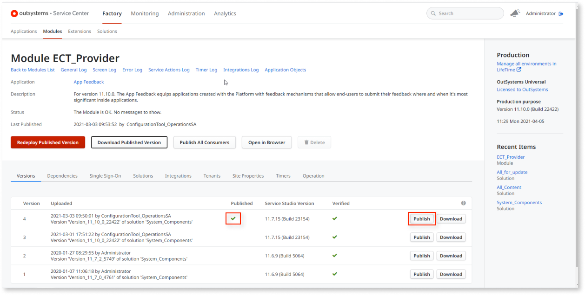

# Moving to a new Activation Code

## Introduction

During the lifecycle of an OutSystems customer, you may need to replace the license of one existing infrastructure (a set of environments) from one Activation Code to another. This could be for a number of reasons, such as organization splitting for example, where an end-customer is split into multiple companies, each licensing OutSystems separately.

Ensuring the change of licenses is done correctly ensures that downtime is avoided and the continued normal functioning of OutSystems.

This article covers a scenario where a full infrastructure, including LifeTime, will be migrated from a source Activation Code *AAA* to a destination Activation Code *BBB*. It also covers as a rollback procedure in case of any problems.

## Moving an entire infrastructure

In this scenario, we begin with a single infrastructure with the following environments:

* LifeTime
* Development
* Quality
* Production

    

This scenario still applies if you have more environments than the ones depicted, provided the requirements of the scenario are met:

* All environments for which you wish to change the activation code are controlled by the LifeTime of your infrastructure. 
* You change the activation code of all environments controlled by the LifeTime of your infrastructure. 
* You change the activation code of the LifeTime of your infrastructure. 

**Important** - Do not proceed if:

* there are other environments where you wish to change the activation code, and those are not controlled by the same LifeTime.
* you do not wish to change the activation code of one or more environments controlled by this LifeTime.
* you do not wish to change the activation code of the LifeTime environment.

### Migration procedure

Please read the complete procedure before starting to execute it. If you have any questions, please reach out to [OutSystems Support](https://success.outsystems.com/Support) ahead of execution. 
To move from the previous Activation Code (AAA in this text) to the new Activation Code (BBB in this text), please proceed as follows:

1.  Pause all deployments to the Production environment.

1.  For all environments, refresh the license file for the activation codes AAA with the new files. Let’s start with the Production environment:

    a. Go to the [Licensing Portal](https://www.outsystems.com/licensing) and enter your old Production environment activation code AAA.
        
    b. Navigate to the serial number of the Production environment and obtain the license file. Keep the file for backup purposes.
        
    c. Upload the license file in Service Center for the Production environment - go to **Administration** -> **Licensing**, and choose **Upload a new License**. Upload the license file that you obtained in the previous step.
        
    d. Still in the Licensing page, filter for the feature **Intellectual Property**. If it reads **Ignore**, you are all good. If not, your license is not prepared for the migration, refer to the [FAQs below](#faqs).

    
            
    e. Repeat steps a. to d. for the remaining three environments.

    

    If you receive any IPP or Intellectual Property errors during the next step, **pause the procedure** for other environments and refer to the [Rollback procedure below](#rollback).

    

1.  Perform a test republish of an eSpace (e.g. ECT_Provider) in **each** environment. 
Go to **Factory** -> **Modules** and filter by ECT_Provider. Open the details of the eSpace, locate the version that is currently published and click **Publish** for that version.

    

### Rollback procedure { #rollback }

1.  Pause all deployments to the Production environment. 
Development activities within an environment other than Production may continue.

1.  For all environments that have licenses from activation code BBB, restore all license files with those backed up in step 3 above.

    a. In Service Center for each particular environment, go to **Administration** -> **Licensing**, and choose **Upload a new License**. Upload each environment’s backed up license file.

    b. Confirm that the activation code displayed is the old activation code AAA.

    

    c. Perform a test republish of an eSpace (e.g. ECT_Provider) in each environment. 
    Go to **Factory** -> **Modules** and filter by ECT_Provider. Open the details of the eSpace, locate the version that is currently published and click **Publish** for that version.

1.  Contact [OutSystems Support](https://success.outsystems.com/Support) to report the issues and to obtain assistance to move forward.

## In case something unexpected happens

If something unexpected happens, refer to the [Frequently Asked Questions below](#faqs) or reach out to [OutSystems Support](https://success.outsystems.com/Support), providing this article and indicating the step at which something unexpected happened.

### FAQs { #faqs }

**I cannot find the serial number of my environment in the old Activation Code**

Please contact OutSystems Support to obtain a license file in a different way. Before contacting Support, please confirm all environments which **do not** appear in the old Activation Code (AAA in the script) so you can ask for help for all those environments all at once.

**The license I uploaded from the old Activation Code AAA is not prepared for the migration**

Please contact OutSystems Support to obtain a license file in a different way. Before contacting Support, please finish uploading all licenses to the environments, so you can provide the complete list of environments that do not mention “Intellectual Property: Ignore” so we can help assist for all environments at once.

**The license I uploaded from the new Activation Code BBB is not prepared for the migration**

Please contact OutSystems Support so we can correct the license definition at our end. Following that, you will need to repeat the obtaining of the licenses for all environments under Activation Code BBB.
