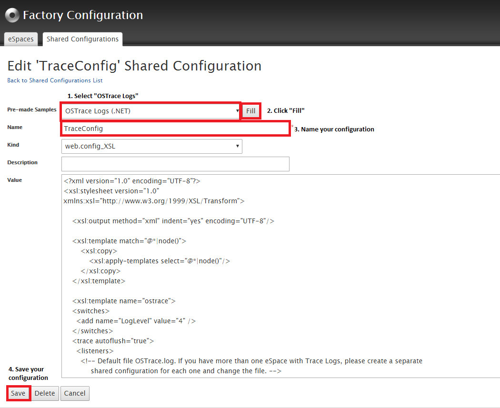
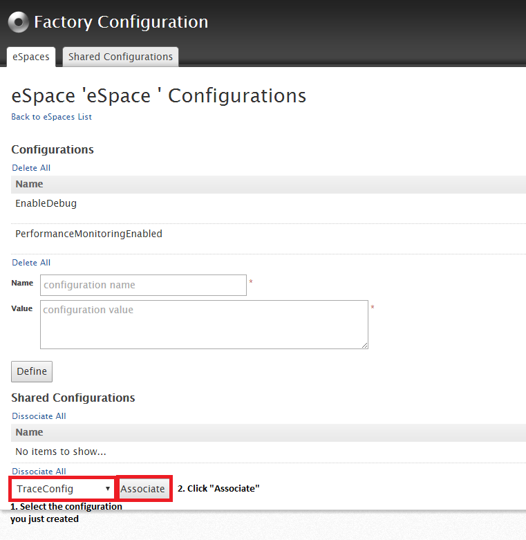

# Change OutSystems Platform logging levels (OSTrace)

**Permalink**: [www.outsystems.com/goto/ostrace](https://www.outsystems.com/goto/ostrace)

## Overview

To troubleshoot problems in your OutSystems Platform, our support team might ask you to increase the log levels of OutSystems services or for runtime applications.

**Increasing the log levels allows to collect more information about what's happening** under the hood. It can be useful both for interactions with Support or for your own analysis of problems. 

In this article we explain how to change the log level of the OutSystems Platform, and some care to be had when performing such change.

## Increase the log levels of OutSystems services

### .NET Stack

OutSystems Platform uses standard logging mechanisms. On the .NET stack it use the System.Diagnostics. To configure System.Diagnostics to be more verbose, add a trace listener to the`.config` file for the application you are tracing. 

These files can be found at `C:\Program Files\OutSystems\Platform Server\`:

* Deployment Controller Service: `CompilerService.exe.config`

* Deployment Service: `DeployService.exe.config`

* Log Service: `LogServer.exe.config`

* Scheduler Service: `Scheduler.exe.config`, if a \Scheduler\ subfolder exists, change it there instead

* SMS Connector: `SMSConnector.exe.config`

* Configuration Tool:`ConfigurationTool.exe.config`
if the file for configuration tool is missing, you may use [this configuration file](https://success.outsystems.com/@api/deki/files/4019/ConfigurationTool.exe.config?revision=1) as example.

Locate the `LogLevel` and `MyListener` lines.

If they are not present, add the following XML immediately after the `</configSections>` or before the `<startup>` lines:

```
<system.diagnostics>
    <switches>                                                                                               
        <add name="LogLevel" value="4" />                                                                       
    </switches>                                                                                             
    <trace autoflush="true">                                                                                 
        <listeners>                                                                                              
            <add name="MyListener" type="System.Diagnostics.TextWriterTraceListener" initializeData="PATH-TO-LOG" /> 
        </listeners>                                                                                             
    </trace>                                                                                                 
</system.diagnostics>                                                                                    
```
 
You'll need to specify the file where you wish your log to be written (`<**PATH-TO-LOG>**`). We suggest writing it to:`C:\Program Files\OutSystems\Platform Server\logs\<NameOfService>.log`,

For example, CompilerService.exe would write to `C:\Program Files\OutSystems\Platform Server\logs\CompilerService.log`.

After editing the log files, you need to restart the service that uses the configuration you've changed.

You can specify a  log level from 0 (less verbose) to 4 (full details) in the `LogLevel` line. When sending logs to Support team, always use the log level 4 (Errors + Warnings + Info + Debug).

### Java stack

In the Java stack we leverage log4j logs. You can increase the log levels for a specific logger. You can edit the logger configuration files at/etc/outsystems/, depending on the service which is being analyzed:

* Deployment Controller Service: `os.controller.service.properties`

* Deployment Service: `os.deployment.service.properties`

* Log Service: `os.log.service.properties`

* Scheduler Service: `os.scheduler.service.properties`

* Configuration Tool: `configurationtool.properties`

Add the following XML 

```
## config for outsystems packages
log4j.logger.outsystems=TRACE 
```

After editing the log files, you need to restart the service that uses the configuration you've changed.

There are several log levels you can use. When sending logs to Support team, always use the TRACE log level.

## Increasing the log levels for runtime applications

### .NET Stack

If your application is running on the .NET stack, we provide you the Factory Configuration, a tool that does most of the heavy-lifting of configuring IIS. Enable traces using the Factory Configuration tool as follows:

1. Download and publish Factory Configuration, available through Forge;

2. Open the Factory Configuration application in the browser and log in with your Service Center credentials;

3. Open the **Shared Configurations** tab and click **Create New Shared Configuration**;

4. On the **Pre-made Samples** dropdown, select **OSTrace Logs** and click the button **Fill**;

5. In the **Value** text box, containing the XSLT code, you can edit the file where the logs will be written (**initializeData** directory inside `**<listeners>**` tag). If you have more than one eSpace with trace logs, please create a separate shared configuration for each one and change the output file;

6. Name your configuration and click **Save**;
    

7. Go back to the **eSpaces** tab and select the application you want to trace;

8. On the dropdown at the bottom, select the configuration you just created and click **Associate**;
    

9. Republish the eSpace.

### Java Stack

We don’t provide any tool to automatically configure traces for applications running on the Java stack, so you will need to manually change the logging settings.

The sections below explain how to enable traces in each of the three Java application servers supported by OutSystems.

#### JBoss/WildFly

1. Edit the file standalone-outsystems.xml in the following folder:

    * JBoss: `<JBoss Folder>/standalone/configuration/` (the default JBoss folder is `/usr/share/jbossas`)

    * WildFly: `/opt/<WildFly folder>/standalone/configuration/`

2. Add or edit the following under the logging subsystem:

    ```
    <logger category="outsystems">
        <level name="TRACE"/>          
    </logger>     
    ```                 

3. Restart the application server with the corresponding command:

   `service wildfly-outsystems restart`

   `service jboss-outsystems restart`

#### WebLogic

1. Log in to your WebLogic Administration Console;

2. On the left pane, click **Environment**;

3. Go to **Servers** and select your application server;

4. Expand the **Advanced** options;

5. Click **Lock & Edit** on the top of the left pane and add the following to the **Platform Logger Levels** box:

    `outsystems=Trace`

6. Click **Save** and **Activate Changes**;

7. Restart your application server with the following command:

    `service weblogic-outsystems restart`

## Notes on increasing log levels

When increasing log levels, the platform and associated software tools will run additional code and write additional (possibly a lot) of log information to disk. As such:

* Disk usage will increase. When increasing log levels, make sure to pick an appropriate location on disk so it has enough space

* Increase I/O on the disk. In most situations the impact of this is minimal, but still, as a best practice, you should use a separate disk volume to minimize the performance hit.

We also recommend lowering the log levels once the troubleshoot session ends. Keeping the log levels high at all times can impact your application performance and disk space usage. 

## Applies to

OutSystems Platform, all versions (last reviewed on 10.0.105.0), on-premises.

