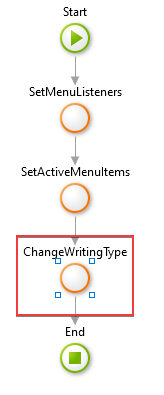

# Troubleshooting issues in multilingual apps

Use this document to read about the issues and recommended workarounds when creating, adding, or editing translations in Reactive Web and Mobile Apps. 

## Right-to-left languages don't show properly

Fixed in Platform Server 11.11.1. 

Update to Platform Server 11.11.1 and use up-to-date Service Studio to prevent issues with the display of content in right-to-left languages.

Apps show content for the right-to-left (RTL) languages left to right instead of right to left. This is a known issue and OutSystems is working on improvements. Until the fix is public, use the workaround below to control how the content shows in your apps.

#### Workaround

The CSS class `is-rtl` defines the styles for the RTL locales. Create custom logic to add the **is-rtl** class for all your RTL locales and remove it for non-RTL locales.

1.  Compile a list of the identifiers for the RTL locales your app supports.

1. Create a new client action that checks if the current locale is RTL, and then add or remove the CSS **is-rtl** class. In this example, the action is **ChangeWritingType**. 

    

    The If node checks the condition **GetCurrentLocale() =** `"ar-AE"`. Since `"ar-AE"` is one of the RTL locales, the logic runs the **AddRTL** node.

    Here is the code for the **JavaScript** nodes:

    * Add RTL class: `document.body.classList.add("is-rtl");` 
    * Remove RTL class: `document.body.classList.remove("is-rtl");`

1. Go to **UI Flows** > **Common** > **Menu** and add the client action you just created to the logic flow of **OnRender** action under **Menu**.

    

    Add your action in the **OnRender** action of an element that runs **in all screens of the app**. In this example, the action is in the **OnRender** of the Menu block.