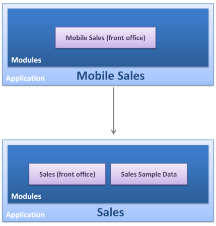
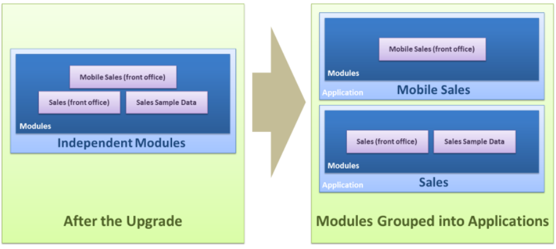
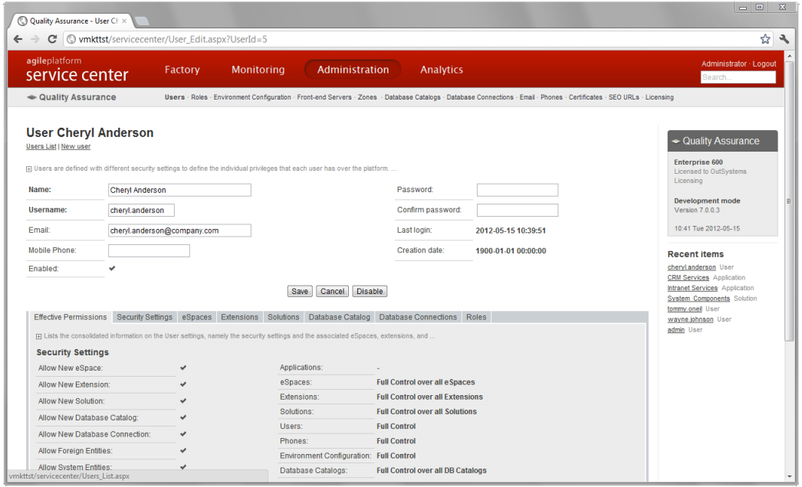

# Organize Modules into Applications

In Agile Platform 7.0, if you are installing the infrastructure management console (LifeTime) on an existing infrastructure, there are some steps that you should perform to minimize the configuration work and to take the most out of it. These steps include organizing Modules into Applications and making sure that each IT user has the same username across all environments. 

## Applications vs application modules

The concept of Application was introduced in version 6.0 and became a core concept in version 7.0. An Application is a logical group of functions implemented in Modules (eSpaces or Extensions) to fulfill business needs or expose services to other Applications.

This means Applications allow to organize Modules, but they are also important because:

* The Application is the minimum deployment unit in LifeTime: you deploy an Application, not a Module. By organizing your modules into applications you have a better control of what is deployed at the end of your sprints.

* The Application is the security management unit in LifeTime: you grant permissions to IT users by Application, not Module. Managing the security of the infrastructure is much easier since teams permissions are directly mapped to applications.

* In Service Center you can take an Application offline with a single click: you don’t have to do it for each one of the Modules.

* In Service Center logs can be filtered by Application.

By definition, a Module belongs to one and only one Application.

## Grouping modules into applications

The example below depicts how Modules should be grouped into Applications:

* The Sales application is composed by the Sales and Sales Sample Data modules.

* The Mobile Sales is composed by the Mobile Sales module. 

All the three modules could be grouped together as part of the same Application, but from a business perspective it makes no sense: they logically belong to two separate applications, each one having a different lifecycle, development team, and stakeholders.

Since the Mobile Sales application uses data and logic exposed by modules that belong to the Sales application, the Mobile Sales depends on the Sales. When deploying the Mobile Sales application to a new environment, the Sales application must also be deployed, or the Mobile Sales will not work properly. This separation also makes it easier to manage the security of the infrastructure: 

* A team of IT users can have access to the Sales application (and all its modules) and have no access to the Mobile Sales application.

* Another team of IT users can have access to change the Mobile Sales application, and only have access to reuse the functionality of the Sales application, not being able to change the Sales application. 

The Sales application can be deployed, without deploying the Mobile Sales modules.

## Regrouping independent modules

After upgrading your OutSystems Platform, modules that were not marked as being an application are grouped into the Independent Modules: a special application with the only purpose of grouping modules which don’t belong to any application.

After upgrading the OutSystems Platform, start by organizing your applications in the Development environment: 

1. Identify which modules in Independent Modules are to be grouped into applications.

2. Create the new applications.

3. Move the modules in Independent Modules to their corresponding applications.

To create an application in the Development environment, proceed as follows:

1. Open Service Studio and log in to the Development environment.

2. Click on the **New Application** button.

3. Type the name of the newly created application, the description (optional), choose an icon (optional), click on **Save**.

4. Go back to the Applications screen by pressing the left arrow on the toolbar and open the **Independent Modules** application.

5. Move each module to the new application using the dropdown menu near the module name (click on the icon that is displayed when you hover the mouse over the module name), select **Move to Another Application**, and choose the new application as destination. 

To simplify the deployment process, you should move all modules from the Independent Modules to their corresponding application. Given that there may exist references between modules, changing a module from an application to another does not affect those references. In the example above, the **MobileSales **module continues referencing the **Sales **module even after the modules are grouped in different applications.

Since the minimum deployment unit in LifeTime is the Application, you will not be able to deploy a single module. This means that either you deploy the Independent Modules (with all modules in it) or you move a specific module to its own application, to be able to deploy it without taking all other modules to the destination environment.

You only have to regroup modules into applications in the Development environment. Once you start registering the environments in LifeTime, they automatically pick up the application definition from the Development environment.

## Consolidating usernames

LifeTime does all the management of IT users across the whole infrastructure. This means that once an environment is registered in LifeTime, it takes over the IT user management from Service Center of that environment and users and roles will no longer be editable in that Service Center.

When you register an environment in LifeTime, IT users in that environment are imported to LifeTime and two situations can occur:

* **The username of an IT user is new to LifeTime: **the IT user is imported to LifeTime and you are simply asked to assign its role (you may change this role later at any time).

* **The username of an IT user already exists in LifeTime: **the IT user password is unified with the already existing in LifeTime, i.e., if the IT user had different credentials for multiple environments, when registering a new environment, the credentials are changed to match the LifeTime credentials. 

Due to this, before you register an environment in Lifetime you need to ensure that each IT user has the same username in all environments; otherwise, the same IT user is going to have multiple users created in LifeTime. For example, if Suzie Davids uses *Suzie_dev *to login in Development and *Suzie_tst *to login in Quality Assurance, you should consolidate the user names, changing the username to *Suzie.Davids*.

To check for IT users with different usernames in different environments, simply match usernames of users belonging to the Service Center of each environment: select the **Administration **tab and the **Users **section to browse users’ data.

## Learn more

You can also learn more about how to [Configure the Infrastructure Management Console](https://success.outsystems.com/Documentation/11/Setting_Up_OutSystems/Configure_the_infrastructure_management_console).

