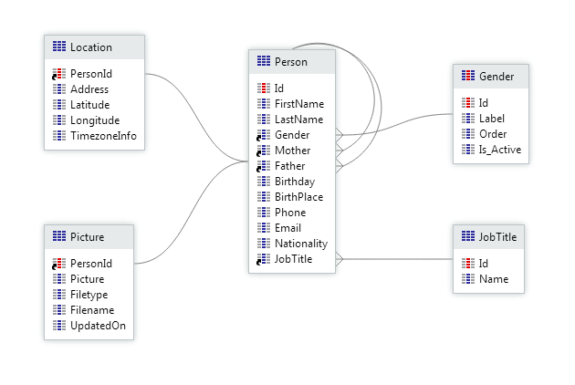
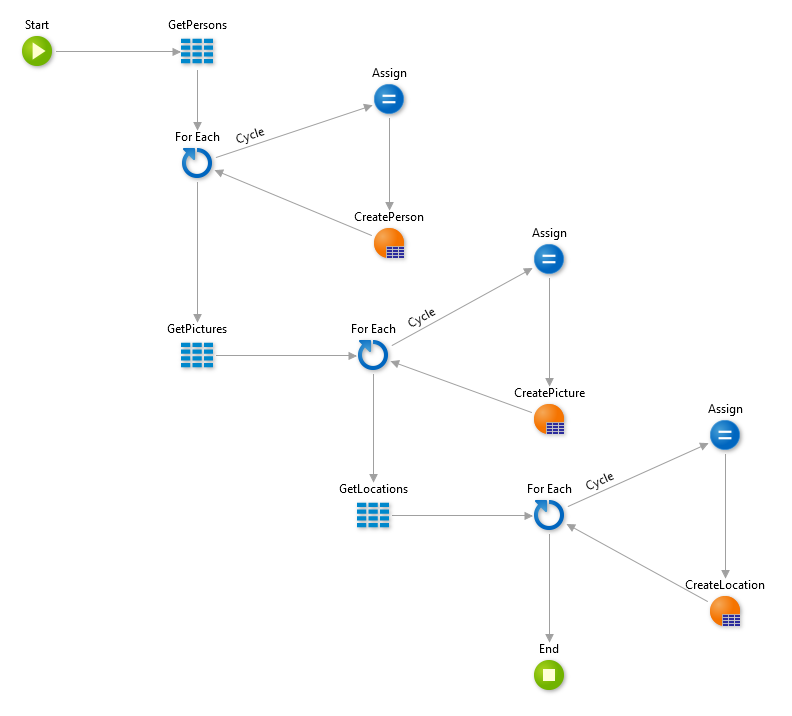

# Upgrade Entity Attributes from Integer to Long Integer

Starting with OutSystems Platform 9.1, we are introducing a new data type: Long Integer. It can be used as any other data type in the Platform, including in entity identifiers and regular entity attributes. This article describes how to change the data type of an existing entity attribute from Integer to Long Integer.

When you first publish a module that uses a Long Integer attribute in some entity, the database schema is created in order to support the new data type, just as you would expect. You do not have to worry about anything, it just works.

However, if you change an existing Integer attribute identifier to have the Long Integer data type and attempt to publish your module, your database is not automatically updated to support the new data type. Such database upgrades would require some downtime when publishing the module, so we decided not to do it automatically in order not to impact your applications.

There are two approaches that we present here in order to perform an upgrade from an Integer attribute to a Long Integer one, and keep the existing data as it was before the upgrade:

* Approach 1 - Performed by the DBA;

* Approach 2 - Performed by the developer (cloud scenarios should use this approach).

## Approach 1 - Performed by the DBA

The following instructions cover the steps that your DBA needs to perform. There are two fundamental cases that you need to consider: upgrading a regular attribute and upgrading an entity identifier.

### *Upgrading a regular entity attribute*

Regarding the upgrade of a regular entity attribute, you only need to go to the Data tab in development environment and change the data type of that attribute to Long Integer. That is:

1. In the development environment, go to the "Data" tab;

2. Replace the data type of the attribute to Long Integer;

3. Publish.

After you publish the module, your attribute will have the correct data type in the database and the data will not be affected. Everything works smoothly.

### *Upgrading an entity identifier (primary key)*

When upgrading an entity identifier, you have to follow some steps to keep everything working as expected:

1. You need to remove the database constraints of the attribute that you are upgrading and also the foreign keys that depend on that attribute. You may also need to remove the indexes of those attributes. Don’t forget to save the scripts because you will need them later!;

2. Use your database management software to replace the attributes data types to the new type:

    * SQL Server corresponds to *bigint*;

    * Oracle corresponds to *number(20)*;

    * MySql corresponds to *BIGINT(20)*.

These are the types that will correctly correspond to the Long Integer type in the OutSystems Platform;

1. Recreate the constraints that you have deleted in the first step. First, the constraints of the upgraded attribute and then the constraints of the attributes that depend on it;

2. Go to development environment, change the entity identifier that you are upgrading to Long Integer. Then, go to each attribute that you have also changed in the database and select the data type that they already have (that points to the attribute that you have upgraded) so that it is refreshed;

3. Publish the module and everything should work!
 However, if it is not the case and you are facing a compilation error that tells you the attribute types doesn’t match, please check if:

    * The database data types are correct and;

    * You have changed all necessary attribute types, including the ones that only refer to the changed identifier (check the previous step).

Now that you have an abstract idea of how it works, let’s analyze a real scenario. Here’s an example:

In the example above, we want to upgrade the *Id* attribute of *Person* entity from Integer to Long Integer. How would you do it?

First, you need to drop the constraints and indexes from the depending attributes (the ones with foreign keys that refer the attribute that you are changing to Long Integer), in this case they are: *Mother* and *Father* from *Person* entity, *PersonId* from *Picture* and *PersonId* from *Location* entity. Note that if you had other attributes depending on at least one of these four attributes, you would have to drop their constraints first and just then you would be able to remove the constraints from these. Then you can drop the constraints from the attribute that is being upgraded. You will probably find some key constraints (primary and foreign keys), some indexes that need to be removed, constraints to define default attribute values and check constraints to ensure that the attributes are not null. So:

1. Remove the constraints from *PersonId* of *Picture* and *Location* entities;

2. Remove the constraints from *Mother* and *Father* of *Person* entity;

3. Remove the constraints from *Id* of *Person* entity.

After that, you can change the *Id* attribute data type to the new data type (e.g. *bigint* if using SQL Server) and the other attributes too. That is:

4. Change the *Id* of *Person* entity data type to the new data type ;

5. Change the *Mother* and *Father* of *Person* entity type to the new data type;

6. Change the *PersonId* of *Picture* and *Location* entities type to the new data type.

Now, you can create the constraints that you have deleted. First for the attribute being upgraded (*Id* from *Person* entity) and just then to the foreign attributes (*Mother* and *Father* from *Person* entity and *PersonId* from *Picture and Location* entities). Note that if you had other attributes depending on the latter attributes, you should recreate their constraints just after this step. Note also that you may need to add not null constraints when recreating primary keys.That is:

7. Create the dropped constraints for the *Id* attribute of *Person* entity;

8. Create the dropped constraints for the *Mother* and *Father* attributes of *Person* entity;

9. Create the dropped constraints for the *PersonId* attribute of *Picture* and *Location* entities.

Lastly, you can go to development environment, change the attribute that is being upgraded to Long Integer and reassign the types of the other changed attributes and publish!

10. Go to development environment

    1. Change the *Id* attribute of *Person* entity to Long Integer;

    2. Select again the data type of the *PersonId* attributes of the *Picture* and *Location* entities to *Person Identifier*;

    3. Publish.

Everything should work by now. Also, the existing data is expected to be as it was before the upgrade.

## Approach 2 - Performed by the Developer

Regarding the approach that may be performed by the Developer(the approach that should be performed in Cloud scenarios), you will only need to use the development environment to do the conversion. Here are the steps that you need to keep everything working as expected:

1. In the Data tab, copy and paste the entities that have the attributes that you want to change from Integer to Long Integer and the entities that have dependencies to them as new entities;

2. Change the attributes from Integer to Long Integer in the entities that you have just created (the copy-pasted ones);

3. Implement and run the code to copy the data from the old entities to the copy-pasted ones. Check if the data was stored correctly;

4. Check the data was stored correctly;

5. Delete the old entities and fix the errors that will appear by pointing the places where the old entities were being used to the new entities. Tip: Rename the new entities to have the same name as the old entities;

6. Publish.

Returning to the previous example, if we want to upgrade the *Id* attribute of *Person* entity from Integer to Long Integer. How would you do it regarding this other approach?

1. Go to the Data tab and copy and paste the *Person*, *Picture* and *Location* entities;

2. Change  the *Id* of *Person* entity data type from Integer to Long Integer;

3. Create a new Web Screen with a Preparation where you should implement the code to copy the data from the old entities to the new ones. It should be similar to something like this:

    

    Note that you should copy and store the data from *Person* entity in the first place so that the other entities will find the data they are referring with their foreign keys.

4. Publish and open the Web Screen that you have just created in the browser so that the preparation code runs and the data is copied. Check if it was stored correctly;

5. Delete *Person*, *Picture* and *Location* entities and rename the new entities (that probably are called *Person2*, *Picture2* and *Location2*) to match the names of the deleted entities (*Person2* renamed to *Person*, *Picture2* to *Picture* and *Location2* to *Location*);

6. Publish.

