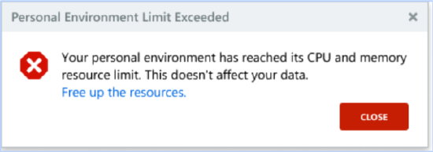
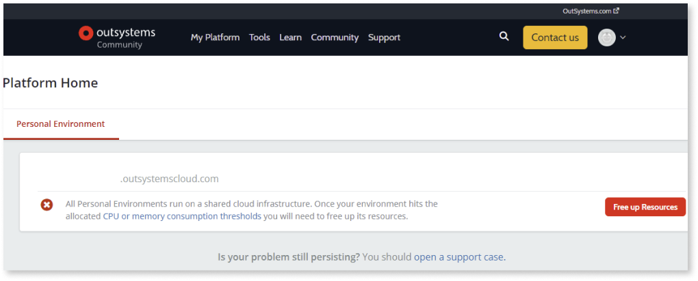

# Personal Environment: Service Unavailable - HTTP Error 503

## Symptoms

### Symptom 1: HTTP Error 503: Service Unavailable

You are accessing eSpace Users (or any other eSpace you created in your Personal Environment) and you get a **Service Unavailable** error message.

### Symptom 2: Error when using 1-Click Publish in Service Studio

You are publishing an eSpace using Service Studio. The deployment phase (3) takes abnormally long and ends with an error indicating that the **Deployment failed**. If you hover the details of the error, you see an that the error is a **(503) Server Unavailable** error which confirms that [symptom 1](#symptom-1:-http-error-503:-service-unavailable) applies.

### Symptom 3: Error in Service Center: The service 'Deployment' could not be reached.

You are accessing Service Center and see an error message in Environment Health related to the Deployment Service being down. This message indicates that [symptom 1](#symptom-1:-http-error-503:-service-unavailable) applies.

### Symptom 4: Error in LifeTime: Environment health problems; Deployment service is down

You are accessing LifeTime and see an error related to Environment Health. When you click the **See detailed report** link, you see that the error is related to Deployment service being down. This message indicates that [symptom 1](#symptom-1:-http-error-503:-service-unavailable) applies.

## Cause

If you are experiencing any of the symptoms above, then your personal environment **has been automatically disabled**. This happened because one of your applications has exceeded the allowed resource usage.

This protection mechanism disables Personal Environments if any of following occurs:

* Your application has at some point **reached the allowed memory limit** for your personal environment.

* You have created an application that was using **too much CPU for a long time**.

* You have created a pattern (an **infinite loop or wrong code pattern** in an integration) that is causing your environment to crash repeatedly.

* You have **too many complex applications running**.

## Resolution

Your Personal Environment can be recovered in the following ways:

* For symptoms 1 and 2, you get the following error in Service Studio: 

    

    Click **Free up the resources**. You are redirected to the following page. Click the *[Free Up Resources](https://www.outsystems.com/home/FreeUpResources.aspx)* button.

    
 
    

    Keep in mind that if the same conditions apply, freeing up resources in the Personal Environment won't automatically stop it from reaching the resource limit again. So, make sure that you troubleshoot the applications that you were working on that might have triggered the temporary suspension of your environment.
    

* For symptoms 3 and 4, or in the case that you have freed up resources but the problem persists, [contact Support](https://success.outsystems.com/Support) who will help you recover your Personal Environment and in solving the problem.
