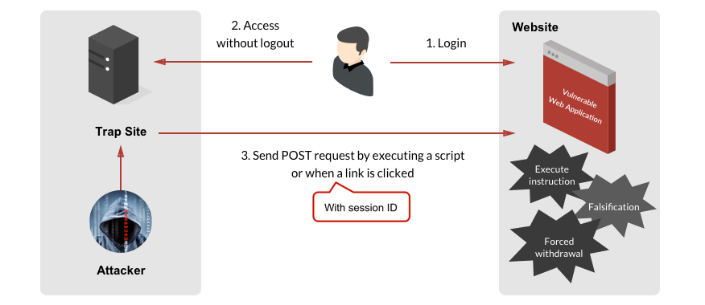

#  Protecting OutSystems apps from Cross Site Request Forgery attacks

Cross-site request forgery (CSRF) is a web security vulnerability used to induce users to perform unintended actions. The following example illustrates how a CSRF attack can trick a user, that hasn't logged out from a vulnerable website, into clicking a trap link that executes a script or sends a fake POST request with the user's session ID:

With the CSRF method, attackers are able to make requests to your application from another site using, for example:

  * Hidden image performing a GET request
  * Link performing a GET request
  * Malicious form performing a POST request
  * On load actions that perform a POST request

## OutSystems built-in protection

Protection against CSRF is shared between the client devices and the application implementation. Until recently, the most robust and generic form of protection was performed only at server side. It consists in including an anti-CSRF token within every or relevant requests:

* For traditional web applications the **osVisitor** cookie stores a token that protects against CSRF attacks. Find the token definition in [this article](https://success.outsystems.com/Support/Enterprise_Customers/Maintenance_and_Operations/Cookie_Usage_in_Web_Applications).
* Reactive web applications the **nr2<user\>** token protects against CSRF attacks. Find detailed information about the token [this article](https://success.outsystems.com/Documentation/11/Managing_the_Applications_Lifecycle/Secure_the_Applications/Configure_App_Authentication#Authentication_Cookies).

However, the token by itself, doesn't provide full CSRF protection. 

A browser performing a request to any website, attaches cookies associated to the request url. To avoid this kind of scenarios, recent versions of the commonly used browsers started enforcing the usage of the SameSite cookie. 

This cookie defines whether all cookies should be sent to an external website or not. Whenever the cookie is absent, the browser default behavior is to not send the cookies unless there is a specific user interaction (for example, clicking a link or a button). 

The OutSystems generated apps don't set the cookie, hence inherit the default behavior, providing the expected CSRF protection.

## How to prevent CSRF attacks when developing APIs

With OutSystems, the development of APIs is entirely in the responsibility of the developer. APIs don't include anti-CSRF tokens by default. To secure your OutSystems APIs against CSRF attacks, we recommend the following actions:

|**Use case** |**Actions** |
|-------------|------------|
|Perform GET requests |<ul><li>**Don't** run actions in the **Preparation**.</li><li>When designing your REST API, **don't** use cookies.</li></ul>|
|Perform POST requests |<ul><li>Make sure there is a [unique token in your request](https://www.outsystems.com/forums/discussion/13556/cross-site-request-forger-token).</li><li>Validate against the expected value in the session.</li></ul>||

## More information 

To learn how to protect your OutSystems apps against other common types of attacks, check [how OutSystems helps you develop secure applications](intro.md).
